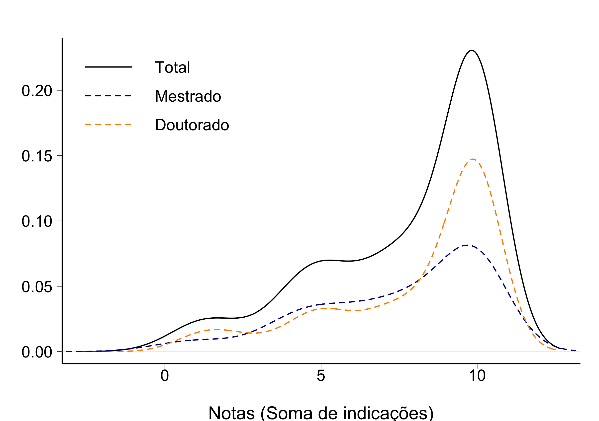
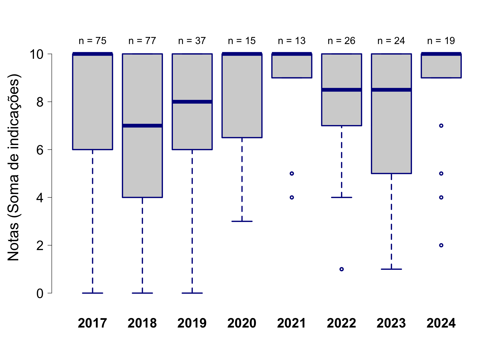
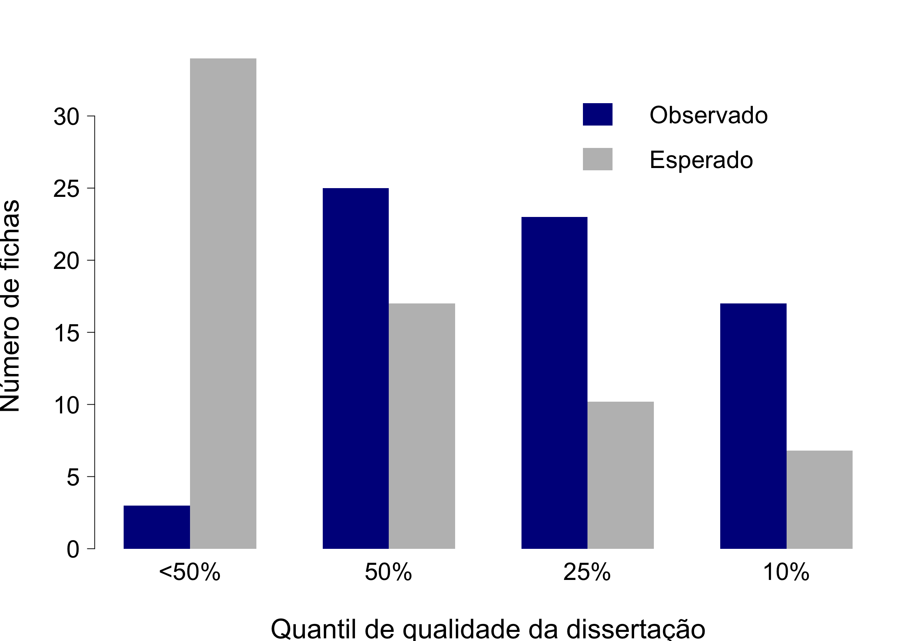
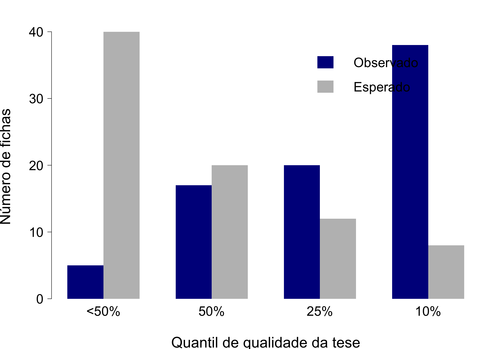
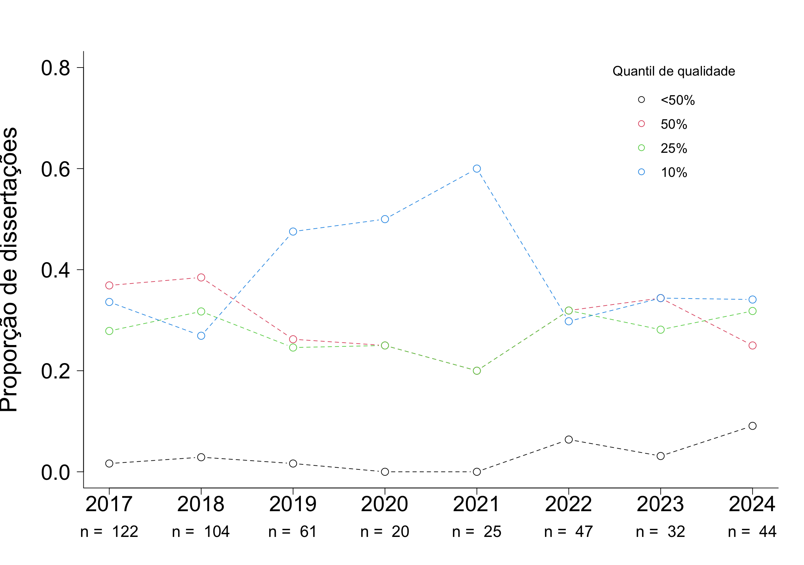
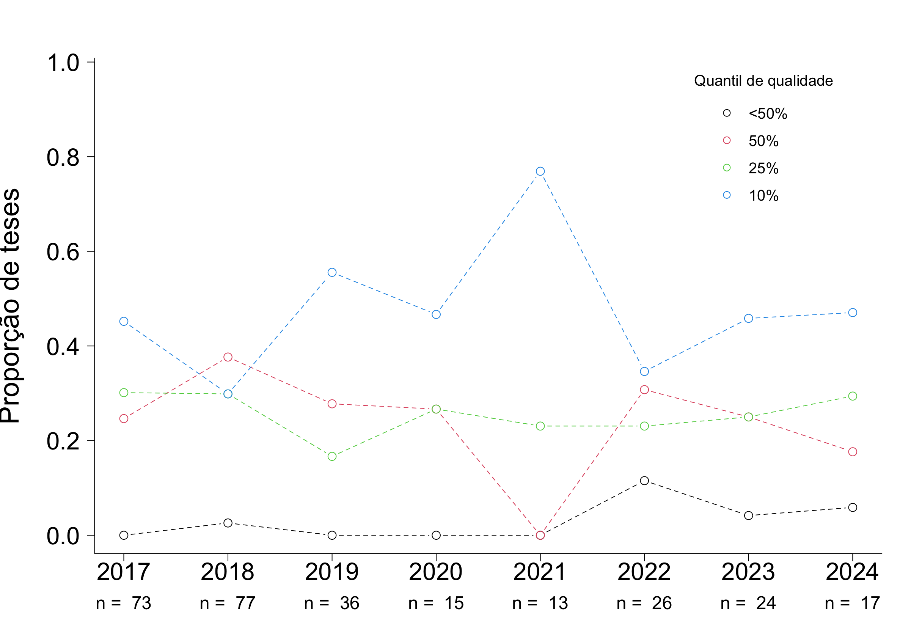
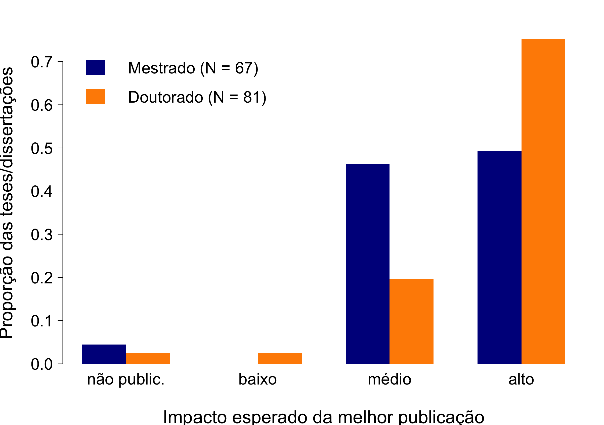
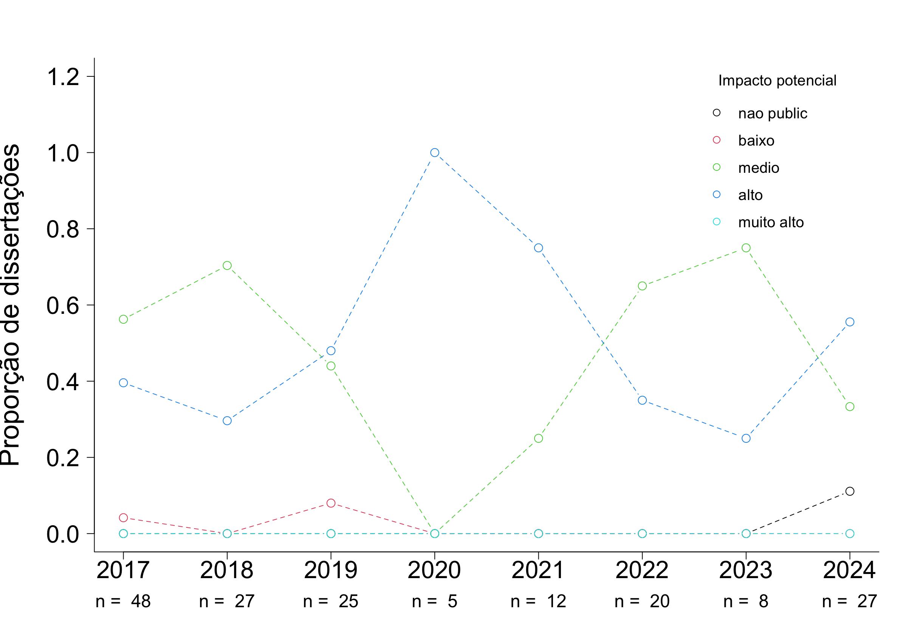
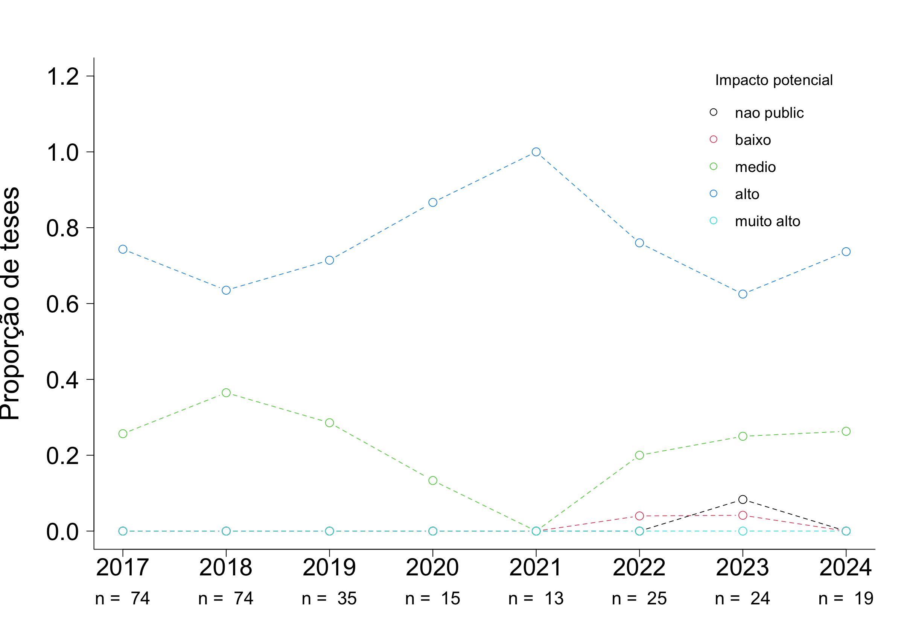

# AVALIAÇÃO DE TESES E DISSERTAÇÕES DO IB-USP 

## BOTÂNICA

## Tamanho da amostra

Foram consideradas apenas as fichas das defesas ocorridas no último quadriênio (defesas entre 2021 e 2024)

**Tabela 1.** Número de trabalhos com ao menos uma ficha preenchida  

|                 | Bot|  IB|
|:----------------|---:|---:|
|Mestrado         |  31| 143|
|Doutorado        |  28| 123|
|Doutorado direto |   4|  10|
|Todos cursos     |  63| 276|

**Tabela 2.** Número de fichas  

|                 | Bot|  IB|
|:----------------|---:|---:|
|Mestrado         |  68| 325|
|Doutorado        |  71| 313|
|Doutorado direto |  11|  22|
|Todos cursos     | 150| 660|
 

## Indicadores

Os avaliadores foram perguntados sobre 10 quesitos e foram orientados a indicar quais dos quesitos o trabalho satisfazia de maneira muito boa ou excelente. Os quesitos estão indicados abaixo, com o número de avaliações que julgaram o trabalho com muito bom ou excelente:  
   
|criterios                                                                          | frequencia| porcentagem|
|:----------------------------------------------------------------------------------|----------:|-----------:|
|Excelencia na redacao                                                              |        119|       79.33|
|Excelencia na contextualizacao teorica                                             |        124|       82.67|
|Excelencia nos objetivos: bem definidos e condizentes com o titulo pleiteado       |        125|       83.33|
|Excelencia nas hipoteses: perguntas e/ou hipoteses sao claras e explicitas         |        117|       78.00|
|Excelencia na originalidade e na relevancia do trabalho                            |        131|       87.33|
|Excelencia nos metodos: bem descritos e adequados para responder a(s) pergunta(s)  |        114|       76.00|
|Excelencia nas analises: bem descritas e adequadas para responder a(s) pergunta(s) |        113|       75.33|
|Excelencia nos resultados: bem apresentados e respondem a(s) pergunta(s).          |        120|       80.00|
|Excelencia na discussao: solida e fortemente alicercada nos resultados obtidos.    |         98|       65.33|
|Excelencia na literatura usada: adequada e atualizada                              |        108|       72.00|

## Notas
Além da análise individual de cada critério, foi realizada também a soma dos aspectos em que a tese/dissertação foi descrita como excelente ou muito boa. As notas de cada tese são as somas do número de indicações por tese/dissertação. Dentre as fichas avaliadas, a média calculada para o curso de Mestrado foi 7.3. (mediana = 8) Doutorado foi 7,8 (mediana = 9).

  
**Figura 1.** Notas calculadas por indicações de teses/dissertações como excelentes ou muito boas. As curvas são kernels de densidade probabilística, uma alternativa preferível a histogramas para representar distribuições de frequência.

  
**Figura 2.** Evolução das notas calculadas por indicações de teses/dissertações como excelentes ou muito boas nos últimos dois quadriênios (entre 2017 e 2024).

  
**Figura 3.** Notas calculadas por indicações de teses/dissertações como excelentes ou muito boas por programa. As curvas são kernels de densidade probabilística.

## Qualidade relativa

A avaliação anônima feita pelos participantes das bancas de defesa, que indicaram a qualidade do trabalho relativa a todos que já orientou ou avaliou, entre quatro classes:

- Abaixo dos 50% melhores que já avaliou/orientou
- Entre os 50% melhores
- Entre os 25% melhores
- Entre os 10% melhores

**Tabela 3.** Qualidade relativa do trabalho (o quesito foi avaliado em 448 fichas)  

|                        | Mestrado| Doutorado| Total| 
|:-----------------------|--------:|---------:|-----:|
|Abaixo dos 50% melhores |       22|        14|    36| 
|Entre os 50% melhores   |      107|        41|   148| 
|Entre os 25% melhores   |      105|        40|   145| 
|Entre os 10% melhores   |       87|        32|   119|

  
**Figura 4.** Qualidade relativa - Mestrado. Também indicado o número esperado em cada categoria se o conjunto avaliado e o já conhecido pela banca forem iguais em qualidade. 

 
**Figura 5.** Qualidade relativa - Doutorado. Também indicado o número esperado em cada categoria se o conjunto avaliado e o já conhecido pela banca forem iguais em qualidade. 

Muitos membros das bancas (27%) consideraram que os trabalhos estavam entre os 10% melhores considerando o conjunto de dissertações e teses que já haviam avaliado e orientado, o que mostra a qualidade dos trabalhos defendidos nos programas do IB. Outras avaliações consideraram que o trabalho estava entre os 25% melhores (145 avaliações, 32%) ou entre os 50% melhores (148 avaliações, 33%). Apenas 36 avaliações (8%) julgaram que o trabalho estava abaixo dos 50% melhores. 

### Evolução da Qualidade relativa - Mestrado

  
**Figura 6.** Evolução da qualidade relativa - Mestrado. Evolução da proporção de teses/dissertações defendidas nos dois últimos quadriênios (entre 2017 e 2024) em cada classe de qualidade. 

### Evolução da Qualidade relativa - Doutorado  

  
**Figura 7.** Evolução da qualidade relativa - Mestrado. Evolução da proporção de teses/dissertações defendidas nos dois últimos quadriênios (entre 2017 e 2024) em cada classe de qualidade. 

## Impacto potencial
 
Os avaliadores também responderam sobre possíveis artigos decorrentes da dissertação ou tese. A maioria deles (380 avaliações, 59%) julgou que pelo menos um artigo derivado do trabalho avaliado poderia ser publicado em periódico de alto fator de impacto em sua área, 228 (35%) em periódico de impacto médio e 27 (4%) em periódico de impacto baixo. Apenas 11 avaliações (2%) indicavam que havia baixa chance de publicação do trabalho. 

**Tabela 4.** Impacto potencial do trabalho (o quesito foi avaliado em 646 fichas)  

|           | Mestrado| Doutorado| Sum|
|:----------|--------:|---------:|---:|
|nao public |        8|         3|  11|
|baixo      |       16|        11|  27|
|medio      |      150|        78| 228|
|alto       |      143|       237| 380|
|Sum        |      317|       329| 646|

  
**Figura 8.** Proporção de teses e dissertações defendidas entre 2021 e 2024, por classe de impacto. Os participantes das bancas de defesa indicaram o impacto potencial da melhor publicação resultante da tese/dissertação, entre quatro classes: (i) há baixa chance de publicação; (ii) impacto baixo; (iii) impacto médio; (iv) impacto alto.

  
**Figura 9.** Proporção de teses e dissertações defendidas entre 2021 e 2024 em cada programa, por classe de impacto. Os participantes das bancas de defesa indicaram o impacto potencial da melhor publicação resultante da tese/dissertação, entre quatro classes: (i) há baixa chance de publicação; (ii) impacto baixo; (iii) impacto médio; (iv) impacto alto.

  
**Figura 10.** Evolução da proporção de teses defendidas entre 2017 e 2024 em cada classe de impacto. 

  
**Figura 11.** Evolução da proporção de dissertações defendidas entre 2017 e 2024 em cada classe de impacto. 

## Comentários

Por fim, no campo para comentários, 33 fichas contém observações, a maioria delas (25) elogiosas, destacando a qualidade da tese. Todas as observações foram transcritas e constam no documento "Anexo 6: Resultados da Avaliação". 

## Outras comparações

### Notas médias por programa
 

