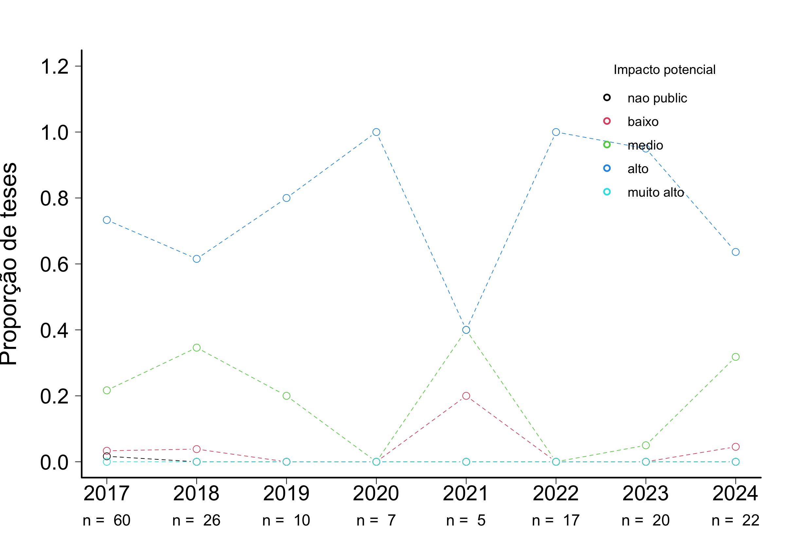

# AVALIAÇÃO DE TESES E DISSERTAÇÕES DO IB-USP 

## ECOLOGIA

## Tamanho da amostra

Foram consideradas apenas as fichas das defesas ocorridas no último quadriênio (defesas entre 2021 e 2024)

**Tabela 1.** Número de trabalhos com ao menos uma ficha preenchida  

|                 | Eco|  IB|
|:----------------|---:|---:|
|Mestrado         |  30| 143|
|Doutorado        |  28| 123|
|Doutorado direto |   0|  10|
|Todos cursos     |  58| 276|

**Tabela 2.** Número de fichas  

|                 | Eco|  IB|
|:----------------|---:|---:|
|Mestrado         |  72| 325|
|Doutorado        |  68| 313|
|Doutorado direto |   0|  22|
|Todos cursos     | 140| 660|
 

## Indicadores

Os avaliadores foram perguntados sobre 10 quesitos e foram orientados a indicar quais dos quesitos o trabalho satisfazia de maneira muito boa ou excelente. Os quesitos estão indicados abaixo, com o número de avaliações que julgaram o trabalho com muito bom ou excelente:  

**Tabela 3.** Quesitos indicados como muito bom ou excelente
   
|criterios                                                                          | frequencia| porcentagem|
|:----------------------------------------------------------------------------------|----------:|-----------:|
|Excelencia na redacao                                                              |        117|       83.57|
|Excelencia na contextualizacao teorica                                             |        101|       72.14|
|Excelencia nos objetivos: bem definidos e condizentes com o titulo pleiteado       |        108|       77.14|
|Excelencia nas hipoteses: perguntas e/ou hipoteses sao claras e explicitas         |         98|       70.00|
|Excelencia na originalidade e na relevancia do trabalho                            |        121|       86.43|
|Excelencia nos metodos: bem descritos e adequados para responder a(s) pergunta(s)  |         91|       65.00|
|Excelencia nas analises: bem descritas e adequadas para responder a(s) pergunta(s) |         89|       63.57|
|Excelencia nos resultados: bem apresentados e respondem a(s) pergunta(s).          |         98|       70.00|
|Excelencia na discussao: solida e fortemente alicercada nos resultados obtidos.    |         83|       59.29|
|Excelencia na literatura usada: adequada e atualizada                              |         93|       66.43|

## Notas
Além da análise individual de cada critério, foi realizada também a soma dos aspectos em que a tese/dissertação foi descrita como excelente ou muito boa. As notas de cada tese são as somas do número de indicações por tese/dissertação. Dentre as fichas avaliadas, a média calculada para o curso de Mestrado foi 6.8. (mediana = 7) Doutorado foi 7,4 (mediana = 9).

  
**Figura 1.** Notas calculadas por indicações de teses/dissertações como excelentes ou muito boas. As curvas são kernels de densidade probabilística, uma alternativa preferível a histogramas para representar distribuições de frequência.

  
**Figura 2.** Evolução das notas calculadas por indicações de teses/dissertações como excelentes ou muito boas nos últimos dois quadriênios (entre 2017 e 2024).

## Qualidade relativa

A avaliação anônima feita pelos participantes das bancas de defesa, que indicaram a qualidade do trabalho relativa a todos que já orientou ou avaliou, entre quatro classes:

- Abaixo dos 50% melhores que já avaliou/orientou
- Entre os 50% melhores
- Entre os 25% melhores
- Entre os 10% melhores

**Tabela 4.** Qualidade relativa do trabalho (o quesito foi avaliado em 137 fichas)  

|                        | Mestrado| Doutorado| Total|
|:-----------------------|--------:|---------:|-----:|
|Abaixo dos 50% melhores |        2|         4|     6|
|Entre os 50% melhores   |       24|        10|    34|
|Entre os 25% melhores   |       22|        26|    48|
|Entre os 10% melhores   |       23|        26|    49|

  
**Figura 3.** Qualidade relativa - Mestrado. Também indicado o número esperado em cada categoria se o conjunto avaliado e o já conhecido pela banca forem iguais em qualidade. 

 
**Figura 4.** Qualidade relativa - Doutorado. Também indicado o número esperado em cada categoria se o conjunto avaliado e o já conhecido pela banca forem iguais em qualidade. 

### Evolução da Qualidade relativa - Mestrado

  
**Figura 5.** Evolução da qualidade relativa - Mestrado. Evolução da proporção de teses/dissertações defendidas nos dois últimos quadriênios (entre 2017 e 2024) em cada classe de qualidade. 

### Evolução da Qualidade relativa - Doutorado  

  
**Figura 6.** Evolução da qualidade relativa - Mestrado. Evolução da proporção de teses/dissertações defendidas nos dois últimos quadriênios (entre 2017 e 2024) em cada classe de qualidade. 

## Impacto potencial
 
**Tabela 5.** Impacto potencial do trabalho (o quesito foi avaliado em 134 fichas)  

|           | Mestrado| Doutorado| Sum|
|:----------|--------:|---------:|---:|
|nao public |        2|         2|   4|
|baixo      |       33|        10|  43|
|medio      |       35|        52|  87|
|alto       |        0|         0|   0|
|Sum        |       70|        64| 134|

  
**Figura 7.** Proporção de teses e dissertações defendidas entre 2021 e 2024, por classe de impacto. Os participantes das bancas de defesa indicaram o impacto potencial da melhor publicação resultante da tese/dissertação, entre quatro classes: (i) há baixa chance de publicação; (ii) impacto baixo; (iii) impacto médio; (iv) impacto alto.

  
**Figura 8.** Evolução da proporção de teses defendidas entre 2017 e 2024 em cada classe de impacto. 

  
**Figura 9.** Evolução da proporção de dissertações defendidas entre 2017 e 2024 em cada classe de impacto. 

## Comentários

Por fim, no campo para comentários, 98 fichas contém observações, a maioria delas elogiosas, destacando a qualidade da tese. Todas as observações foram transcritas no seguinte formato: **id aluno**: programa: comentário.

**657**: Eco: Trabalho bem escrtio. Precisa apenas ajustes nos métodos para tornar mais claro o objetivo.  
**52**: Eco: Os meus comentários foram feitos no momento da defesa e fiquei satisfeito com as respostas do discente/candidato  
**230**: Eco: A dissertação apresentada é de ótima qualidade, no qual os capítulos já foram publicados em revistas de alto impacto na área de Ecologia. O aluno mostrou pleno domínio da área e no tema da sua tese. O aluno e o orientador estão de parabéns pelo excelente trabalho.  
**230**: Eco: A tese é composta por dois capítulos que já foram publicados, em duas das revistas mais influentes na área em âmbito global. Vale ressaltar que uma dessas publicações integra a renomada revista Nature. Portanto, trata-se de um trabalho de tese excepcional.  
**230**: Eco: Os dois capítulos da tese já estão publicados em periódicos de altíssimo impacto (Natures e Proc. Royal Soc.)  
**398**: Eco: Os comentários menores foram incluídos diretamente no PDF da tese  
**398**: Eco: Trabalho excelente, muito bem conduzido e orientado. Um dos capítulos já foi publicado em revista de elevado fator de impacto. Outro capítulo já está na segunda rodada de revisão em outra revista também de elevado impacto. Apresentação muito boa e figuras de excelente qualidade  
**398**: Eco: **398** apresentou uma tese excelente com excelentes capítulos/artigos que serão publicados em revistas de alto impacto. Senti falta de algumas citações mais recentes e indiquei isso na defesa. Além disso, a discussão do único capítulo não submetido para publicação ainda merece melhor editoração. Fora isso, a tese está excelente.  
**571**: Eco: O estudo é de elevada qualidade, sendo a parte analítica é muito forte. As sugestões e comentários realizados foram principalmente para fazer ajustes conceituais, esclarecer e melhorar a parte dos métodos, assim como levar em conta alguns fatores que poderiam ter influenciados após direcionar e sintetizar bem as mensagens.  
**221**: Eco: Potentially high impact with addition of theoretical context etc. This is very interesting work that will be impactful to the field. However, I think that it can be better theoretically contextualized to improve its broader impact. These are relatively minor criticisms.  
**298**: Eco: Nada a acrescentar  
**566**: Eco: A dissertação do **566** excedeu as minhas expectativas porque raramente encontro trabalhos com alta qualidade de redação, argumentação, originalidade, análises estatísticas e discussão dos resultados em bancas de mestrado. Parabéns ao orientador e à pós-graduação por formar alunos com esse nível.  
**566**: Eco: A apresentação do trabalho durante a defesa foi muito bem explicada e exposta de forma muito elegante.  
**145**: Eco: Recomendo apenas que adicionado um fechamento do trabalho, incluindo as principais conclusões obtidas por esse estudo, seja a partir da adição de um item (Conclusões ou considerações finais) ou no último parágrafo do item discussões.  
**15**: Eco: O estudo está muito bem estruturado, com um método bem escolhido, e uma contribuição bem clara à literatura existente.  
**215**: Eco: O projeto do aluno é destacável por ter incluído já na defesa dois artigos publicados e um terceiro artigo quase pronto para submeter. Uma das questões mais interessantes do projeto é a integração de diferentes escalas taxonômicas/filogenéticas num projeto bem abrangente e que conversa entre distintas disciplinas, da historia natural até a biologia evolutiva passando pela biologia da conservação.  
**558**: Eco: É uma das melhores teses de Ecologia que eu já avaliei. O trabalho é muito original e faz uma contribuição importante para a área.  
**402**: Eco: A tese está muito bem escrita, e possui figuras muito bem elaboradas. Entretanto, o segundo capítulo necessita de revisão nas variáveis analisadas e na discussão. Alguns estudos importantes que podem embasar melhor a discussão foram ignorados. Ver sugestões no arquivo da teses enviado.   
**530**: Eco: O trabalho é original e interessante. No entanto, acho que, por ser uma tese, necessitaria de uma linha teórica mais sólida ao longo dos capítulos. Também acho que deveria ter um terceiro capítulo, de cunho mais aplicado. Infelizmente as PGs tem incentivado apenas artigos (e não documentos de tese mais completos) o que reflete nesta caractetística observada  
**530**: Eco: Há algumas falhas na seção de material e métodos, onde muitas informações fundamentais (...) as discussões e interpretações fora omitidas mas o trabalho é muito bom, bem escrito e bem fundamentado. Uma forte limitação é que a análise é apenas de plantas jovens, com 1.5 ano de plantio, o que acaba pondo em cheque a possibilidade de extrapolação para plantas mais velhas e diminui o caráter preditivo das análises. só por isso não poderia ser publicado em uma revista de alto impacto.  
**249**: Eco: O trabalho ou tese é muito interessante e vai trazer boa contribuição científica para o tema de restauração. Algumas correções são necessárias mas o trabalho foi bem defendido e tem boas condições de ser publicado, se revisão for feita. A tese deve ser aprovada.  
**249**: Eco: impacto médio também foi marcado  
**249**: Eco: impacto alto: 1 artigos; impacto médio: 2 artigos  
**528**: Eco: Excelente tese. O capítulo 3 ainda precisa de trabalho, mas tem ótimo potencial.  
**537**: Eco: O trabalho é de grande relevância na área de ecologia, é uma abordagem inovadora e tem grande aplicação prática. Representa um avanço para o monitoramento da eutrofização de reservatórios.  
**207**: Eco: 3 dos 4 artigos relacionados a tese já foram publicados  
**564**: Eco: O trabalho é de muito bom nível científico. Texto fluido, conciso, preciso, boas proposições e argumentações, de modo geral. No entanto, penso que poderia haver um maior detalhamento de algumas informações que, quase sempre, são passadas de modo tão direto e objetivo, que chega a ser "resumidos". Enquanto "artigo científico", o trabalho tem enorme potencial e certamente poderá ser publicado em um bom periódico. Já enquanto "dissertação de mestrado", objeto da presente análise, poderia se encontrar melhor elaborado.  
**91**: Eco: O trabalho é ótimo e deveria ter sido convertido para doutorado direto, pois teria mais tempo para refinar trabalho e até ampliar área para além do estado.  
**91**: Eco: Há que se contextualizar um pouquinho melhor as interações desse trabalho com políticas públicas em mudanças climáticas em SP. Vide outras sugestões no PDF da dissertação.  
**111**: Eco: Minha resposta anterior baseia-se na minha percepção de qualidade da tese, nos quesitos mais gerais que um excelente trabalho científico deve atender no entanto, pelo fato de não conhecer a área específica na qual o trabalho está inserida julgo que não tenho um entendimento completo sobre dos impacto que o material produzido poderia gerar na área específica.   
**111**: Eco: A tese elaborada pelo aluno **111** é uma das melhores teses que já avaliei. O aluno realizou um trabalho de coleta e análise de dados de uma magnitude impressionante, foi capaz de situar o problema de pesquisa claramente dentro da teoria adjacente, e de discutir seus resultados de forma abrangente e objetiva.  
**111**: Eco: Gostaria de registrar meus parabéns ao **111**, pelo belíssimo trabalho executado ao longo destes quatro anos. Foi um prazer enorme e um privilégio ter sido seu orientador.  
**155**: Eco: Dissertação cujo tema poussi alto potencial para continuidade em pesquisas.  
**32**: Eco: O trabalho está muito bem escrito, e a aluna demonstra total domínio da metodologia e uma excelente fundamentação teórica.  
**32**: Eco: O trabalho é excelente, muito bem escrito e a apresentação também foi muito clara e didática. Os resultados foram muito bem analisados e apresentados. O trabalho tem carater inovador e é impressionante para o nível de mestrado  
**276**: Eco: A tese combina um estudo de revisão com dois estudos empíricos extremamente bem feitos, contribuindo assim para avanços importantes nas áreas de ecologia de paisagens e biologia da conservação  
**288**: Eco: Considero que todos os trabalhos elaborados tem condições de serem publicados em periódicos de elevado impacto.   
**288**: Eco: O candidato apresenta maturidade como pesquisador. Ao longo da tese, em base aos coautores dos diferentes artigos, o candidato forjou uma rede de pesquisadores de alta qualidade e altamente interdisciplina. Pois as perguntas levantadas pelo candidato envolvem áreas de diferentes campos (química ambiental, ecotoxilogia, ecologia) o candidato forjou uma equipe muito potente para desenvolver os retos metodológicos decorrentes das perguntas levantadas no iníco do trabalho. Esto, na minha opinião, acrescenta o lvaor do trabalho apresentado. Na minha opinião o candidato tem altas possibilidades como pesquisador independente e de qualidade e um alto potencial para desenvolver pesquisa inovadora no seu campo de pesquisa.  
**666**: Eco: Dissertação bem redigida, texto claro e conciso, já em formato de artigo. Sugestão de periódico para publicação: Oikos.  
**643**: Eco: Texto muito bom; porém com hipóteses não muito delimitadas; resultados explorados em grande quantidade, poderia ser mais sintético; discussão fragmentada.  
**643**: Eco: O trabalho foi desenvolvido com dedicação intensa do candidato e ao longo do desenvolvimento do trabalho o candidato mostrou um progresso em maturidade e domínio do conteúdo e da área de conhecimento associado.  
**4**: Eco: This is a well written thesis, which sets up its questions well and attempts a large experiment in order to answer an interesting question. The test would benefit from some work on the English and grammar to lift it to a higher standard.  
**250**: Eco: 
  
**213**: Eco: impacto médio também foi marcado  
**144**: Eco: Excelente tese  
**214**: Eco: item 3: impacto médio também foi marcado  
**422**: Eco: Um dos artigos já está publicado em periódico de alto impacto. O outro também tem todas as condições para ser publicado em periódico de alto impacto  
**422**: Eco: O trabalho tem um importante caráter interdisciplinar no qual a aluna teve que aplicar técnicas estatísticas e computacionais avançadas dando excelência e originalidade ao mesmo  
**127**: Eco: A tese é inovadora e foi bem redigida. A aluna demonstrou em sua tese grande conhecimento teórico sobre o assunto. Além disso, demonstrou excepcional habilidade para abordar as questões de sua tese valendo-se de diferentes abordagens (experimental e comparativa) com diferentes organismos. Minha expectativa é que os capítulos rendam publicações em periódicos de alto impacto na área de Ecologia/Evolução.  
**547**: Eco: Considero que para um trabalho de dissertação de Mestrado, o projeto que eu avaliei está excepcionalmente bem escrito, bem fundamentado e de uma atualidade e coerência extraordinárias. Parabenizo o orientador assim como o Programa de Pós em Ecologia da USP pela produção de uma aluna tão bem preparada e de um trabalho que certamente será publicado em uma revista de alto impacto. Adicionalmente, considero que o escopo teórico do trabalho tem grandes chances de produzir um impacto relevante na área de ecologia comportamental.  
**547**: Eco: Dissertação extremamente bem conduzida.  
**237**: Eco: Houve mudança de área e tema de investigação tardiamente  
**53**: Eco: O trabalho está muito bem redigido, organizado e claro. Os capítulos já estão formatados para submissão para revistas científicas. O estudo é inovador e a temática é instigante, fazendo com que a pesquisa seja de grande relevância e impacto na comunidade científica.  
**372**: Eco: Felicito a la tesista y a su director por el gran nivel alcanzado en esta tesis, tanto desde el punto de vista de novedades científicas, como en el grado de rigurosidad y detalle en el diseño de los experimentos y en el análisis de los dados.  
**621**: Eco: The results have the potential to be published in high impact journals within the field of paleobiology  
**166**: Eco: (High impact factor) top journal in ecology and evolution. The thesis is well written and each work contains a lot of novelty and quite advance formal theory  
**541**: Eco: O trabalho é original e irá trazer uma contribuição importante para a área.  
**113**: Eco: Student is to be commended on an excellent thesis and defense despite the difficulties of the covid-19 pandemic.  
**16**: Eco: Apesar da boa qualidade do trabalho, a amostra foi pequena (por vários problemas logísticos)  
**16**: Eco: O objetivo da dissertação é bem atual e relevante para questões importantes na gestão das áreas protegidas. A inclusão de referências nacionais, assim como questões de saúde, na revisão da literatura podem tornar esse capítulo mais forte para publicação. Para o capítulo 2, sugiro a organização das recomendações de forma mais sistemática e alinhadas a ferramentas de planejamento e gestão de áreas protegidas.  
**211**: Eco: impacto médio também foi marcado  
**563**: Eco: O trabalho possui alta revelância teórica e aplicada. O tema é de amplo interesse; o trabalho é original; o texto é  extremamente bem escrito, claro, conciso e aborda adequadamente os conceitos, teórias e literatura relevante.  
**417**: Eco: artigo submetido  
**389**: Eco: Necessidade de reformulações profundas  
**389**: Eco: Trata-se de uma tese de enorme importâncai e todos esforços devem ser feitos para que as correções devam ser feitas e atese ser transformada em pelo menos dois artigos de qualidade.  
**389**: Eco: Necessita, para publicação, de maior trabalho em cima do material apresentado  
**349**: Eco: Os pontos fracos ficaram mais relacionados com a interpretação e discussão dos dados obtidos.  
**307**: Eco: (impacto alto) com as correções sugeridas no texto  
**258**: Eco: A escrita estava excelente. A parte do impacto deve-se principalmente a escolha de vida profissional da (ex) aluna. Ela pretende ir para a divulgação científica, o que faz o trabalho ser bem mais da história natural de comportamentos poucos estudados. Não é algo ruim, muito longe disso, é só uma questão de escolha.  
**357**: Eco: Sem comentários adicionais  
**410**: Eco: O trabalho desenvolvido foi muito bom, mas a descrição da metodologia deixou muito a desejar.  
**662**: Eco: O artigo ainda está sendo finalizado.  
**510**: Eco: Já foi publicado em periódico de impacto com FI 6,5  
**233**: Eco: O trabalho levanta dados originais sobre a caça na Amazônia através de monitoramento a longo prazo bem conduzido. Embora o trabalho precise deajustes, sobretudo na discussão, isso pode ser corrigido na versão final e principalmente na fase de publicação  
**551**: Eco: Trabalho bem executado, com alguns aspectos pontuais a revisar, os quais foram
enviados no PDF da tese aos orientadores, com potencial de publicação em periódico
bem qualificado. Para além disso, a partir da organização dos conceitos, das
comunidades e das abordagens transdisciplinares, o trabalho traz contribuição notável
para as comunidades de pesquisa em ecologia e conservação, em vista do
aprimoramento de práticas transdisciplinares importantes tanto para a efetividade quanto
para a justiça socioambiental na conservação.  
**285**: Eco: O trabalho como um todo (para além do apresentado) tem um conjunto de dados qualitativos grande e relevante para a análise realizada. Sugiro transformá-lo em parte dos dados, pois a maior parte aparece na discussão sem contextualização.  
**106**: Eco: item 3:impacto médio também foi marcado. comentário item 3:depende de como será trabalhado.  
**106**: Eco: 1) Repensar relação e influencia entre as escalas macro- micro- doméstica- individual, que nnão fique tão unilinear;
2) em que medida as estratégias locais são 'adaptações' ou então 'resistência'?
3) aproveitar mais os dados etnográficos para o diálogo com ecologia política e simbólica;
4) melhorar apresentação dos dados antropométricos para facilitar a visualização.  
**106**: Eco: Passível de publicação e bom boa chance de impacto na audiência interdisciplinas nacional.  
**84**: Eco: A tese representa uma importante contribuição para a área de restauração florestal de Áreas de Preservação Permanente. A abrangência dos dados obtidos e das análises realizadas viabilizam a publicação de um ou mais artigos em revistas de alto impacto. Faltou definir a hipótese ou hipóteses do trabalho. É necessário atualizar a lista de espécies, incluindo a categoria Invasoras, uma vez que várias das espécies exóticas consideradas naturalizadas são comprovadamente invasoras. As áreas comparadas apresentam diferenças de solos e merecem ser melhor avaliadas.  
**554**: Eco: comentário item 3: artigos no tema, mesmo de qualidade, dificilmente são publicados em revistas de alto impacto  
**589**: Eco: O primeiro capítulo está excelente e deve gerar publicação de impacto. O capítulo 2 tenho restrições de escolha da área, que não representa a realidada para ser extrapolada e esta muito descritivo e poderia ser mais propositivo com outras modelagens.  
**589**: Eco: O trabalho está bem estruturado, com métodos e resultados adequados e discussão compatível com a quantidade de dados. Fiz várias sugestões para melhorar os artigos para publicação e a versão final da dissertação.  
**589**: Eco: Falta uma conexão clara entre os capítulos, sendo o capítulo 2 muito melhor, mais relevante, bem fundamentado e discutido do que o capítulo 1.  
**497**: Eco: Ainda que se queiramos publicar em revistas de alto impacto, eu percebo que um trabalho com essa característica tão teórica não teria grande sucesso em uma revista de alto impacto.  
**497**: Eco: O trabalho é original e interessante. Entretanto, o texto merece mais assertividade. Aluna e orientadora estão de parabéns.  
**526**: Eco: O discente demonstrou segurança e claro domínio sobre a temática. Abordou todos os pontos levantados pelos membros da banca com criticidade e maturidade. A apresentação foi de alta qualidade, com slides adequados e uma oratória eloquente.  
**526**: Eco: O discente demonstrou não apenas a excelência de seu trabalho escrito, que já foi publicado em um periódico de alto impacto, mas também se destacou pela qualidade de sua apresentação. Com uma ótima oratória e uma habilidade notável para transmitir suas ideias com clareza, ele respondeu de forma precisa e segura a todos os questionamentos da banca avaliadora. O desempenho durante a arguição foi exemplar, revelando profundo domínio do tema e capacidade de articular respostas fundamentadas e consistentes  
**162**: Eco: A tese apresentada é de ótima qualidade e traz importantes contribuições para a área de Ecologia de interações e conservação de espécies. Destaque aos métodos de análise usados, que trazem meios de analisar dados complexos e bastante variáveis. A doutoranda e seu orientador desenvolveram um ótimo trabalho, que certamente será publicado em revistas de alto impacto  
**450**: Eco: Os dois capítulos encontram-se em formato muito próximo do requerido para publicação e apenas alguns ajustes precisam ser feitos.  
**253**: Eco: O texto apresenta muitos erros gramáticais, redação confusa em vários trechos, legendas de figura e tabelas incompletas e de leitura cansativa em função de muitos valores numéricos ao longo do texto. Para este tipo de trabalho, a apresentação dos resultados junto com a discussão, provavelmente não contribuiu para a clareza na apresentação dos resultados, sua interpretação e discussão. Porém, claramente o esforço da aluna na execução do trabalho de campo, laboratório e análise dos dados foi grande e realizado com grande dedicação e profissionalismo.  
**253**: Eco: Faltou no estudante uma melhor estruturação do documento da tese. Um levantamenteo de dados adequado dos últimos 5 anos.  
**587**: Eco: Apresentei minhas considerações na defesa  
**223**: Eco: O estudante apresentado é inédito no Brasil e tem um bom potencial de alcançar o interesse de uma ampla gama de leitores. A tese está bem estruturada, com três capítulos sequenciais e complementares. O texto já está escrito em inglês, aspecto que irá acelerar a submissão dos manuscritos. Parabéns à candidata e aos orientadores.  
**428**: Eco: Acredito que a revista escolhida por eles para submissão é adequada (Oikos).  
**194**: Eco: Excelente trabalho! Fiquei impressionada!  
**194**: Eco: 

**194**: Eco: Ótimo trabalho e apresentação. 

