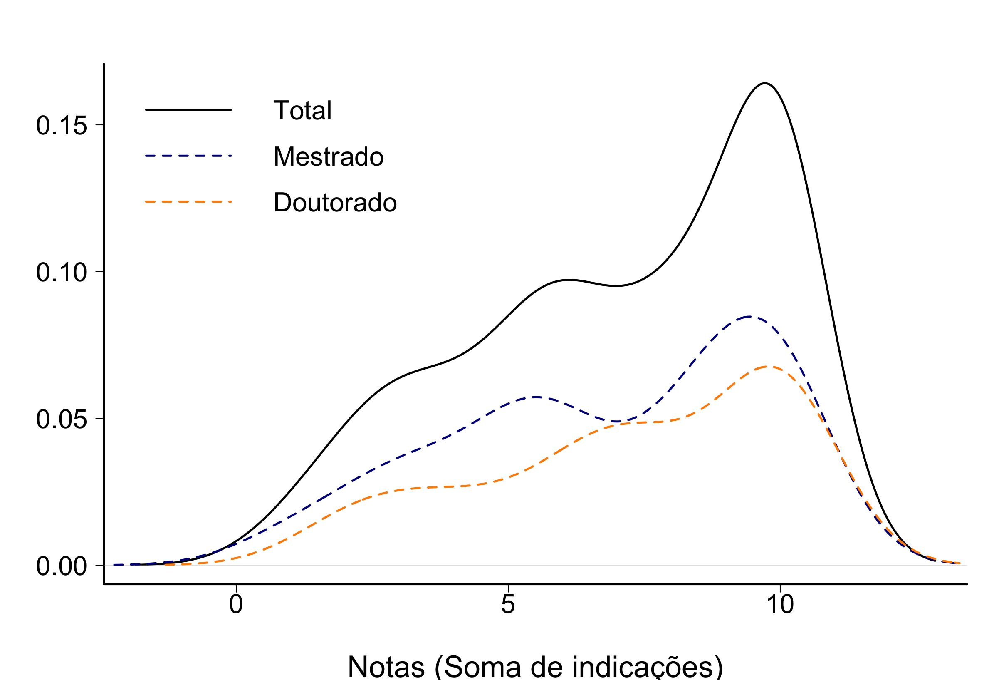
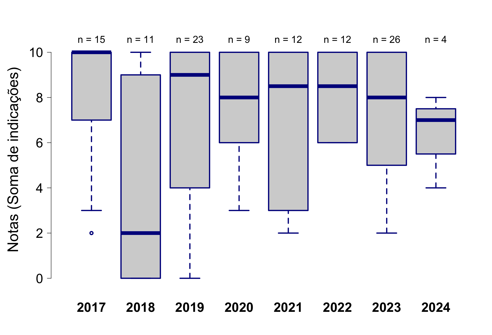
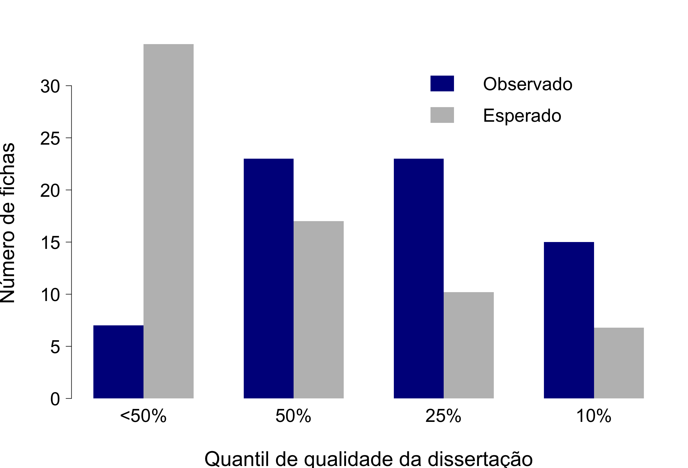
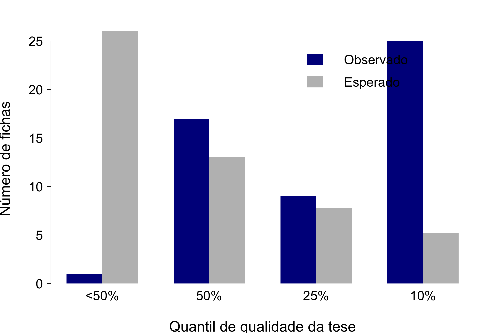
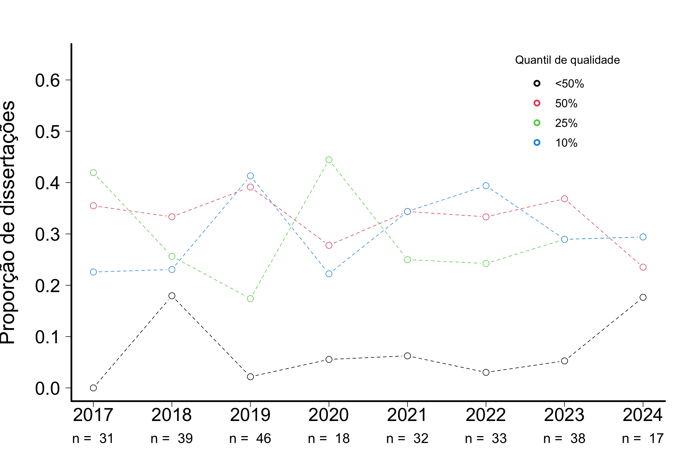
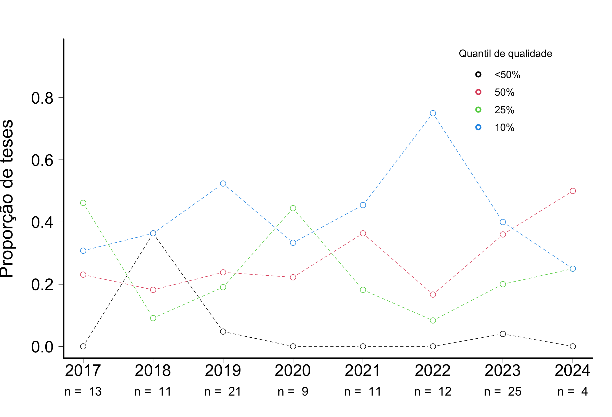
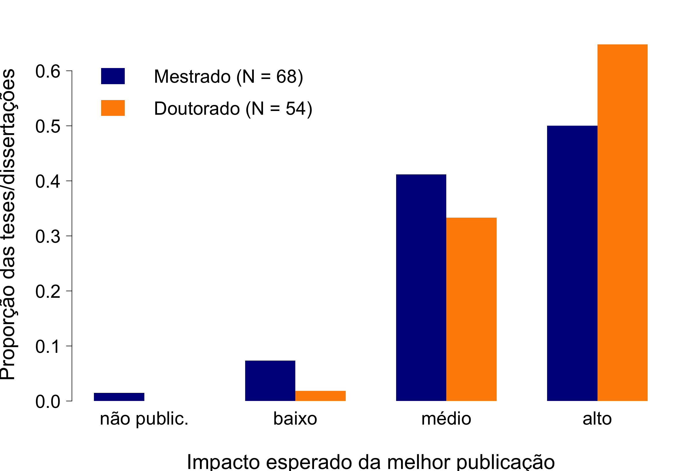
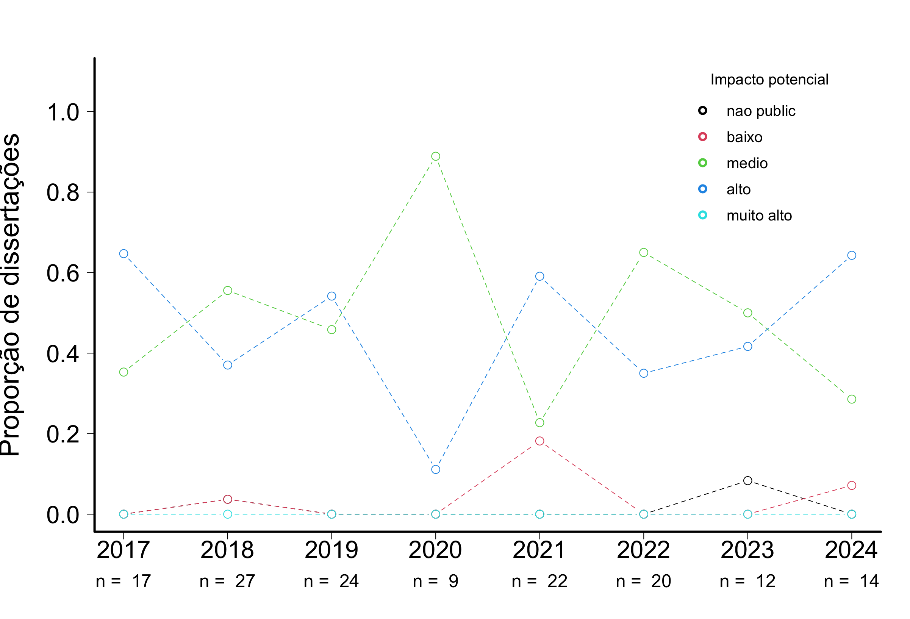
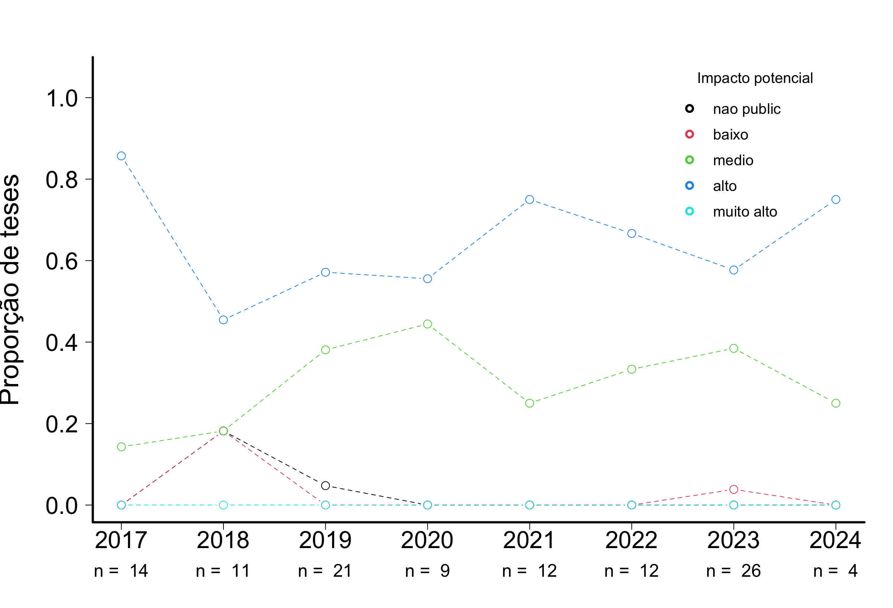

# AVALIAÇÃO DE TESES E DISSERTAÇÕES DO IB-USP 

## FISIOLOGIA

## Tamanho da amostra

Foram consideradas apenas as fichas das defesas ocorridas no último quadriênio (defesas entre 2021 e 2024)

**Tabela 1.** Número de trabalhos com ao menos uma ficha preenchida  

|                 | Eco|  IB|
|:----------------|---:|---:|
|Mestrado         |  30| 143|
|Doutorado        |  28| 123|
|Doutorado direto |   0|  10|
|Todos cursos     |  58| 276|

**Tabela 2.** Número de fichas  

|                 | Eco|  IB|
|:----------------|---:|---:|
|Mestrado         |  72| 325|
|Doutorado        |  68| 313|
|Doutorado direto |   0|  22|
|Todos cursos     | 140| 660|
 

## Indicadores

Os avaliadores foram perguntados sobre 10 quesitos e foram orientados a indicar quais dos quesitos o trabalho satisfazia de maneira muito boa ou excelente. Os quesitos estão indicados abaixo, com o número de avaliações que julgaram o trabalho com muito bom ou excelente:  

**Tabela 3.** Quesitos indicados como muito bom ou excelente
   
|criterios                                                                          | frequencia| porcentagem|
|:----------------------------------------------------------------------------------|----------:|-----------:|
|Excelencia na redacao                                                              |        117|       83.57|
|Excelencia na contextualizacao teorica                                             |        101|       72.14|
|Excelencia nos objetivos: bem definidos e condizentes com o titulo pleiteado       |        108|       77.14|
|Excelencia nas hipoteses: perguntas e/ou hipoteses sao claras e explicitas         |         98|       70.00|
|Excelencia na originalidade e na relevancia do trabalho                            |        121|       86.43|
|Excelencia nos metodos: bem descritos e adequados para responder a(s) pergunta(s)  |         91|       65.00|
|Excelencia nas analises: bem descritas e adequadas para responder a(s) pergunta(s) |         89|       63.57|
|Excelencia nos resultados: bem apresentados e respondem a(s) pergunta(s).          |         98|       70.00|
|Excelencia na discussao: solida e fortemente alicercada nos resultados obtidos.    |         83|       59.29|
|Excelencia na literatura usada: adequada e atualizada                              |         93|       66.43|

## Notas
Além da análise individual de cada critério, foi realizada também a soma dos aspectos em que a tese/dissertação foi descrita como excelente ou muito boa. As notas de cada tese são as somas do número de indicações por tese/dissertação. Dentre as fichas avaliadas, a média calculada para o curso de Mestrado foi 6.8. (mediana = 7) Doutorado foi 7,4 (mediana = 9).

  
**Figura 1.** Notas calculadas por indicações de teses/dissertações como excelentes ou muito boas. As curvas são kernels de densidade probabilística, uma alternativa preferível a histogramas para representar distribuições de frequência.

  
**Figura 2.** Evolução das notas calculadas por indicações de teses/dissertações como excelentes ou muito boas nos últimos dois quadriênios (entre 2017 e 2024).

  
**Figura 3.** Notas calculadas por indicações de teses/dissertações como excelentes ou muito boas por programa. As curvas são kernels de densidade probabilística.

## Qualidade relativa

A avaliação anônima feita pelos participantes das bancas de defesa, que indicaram a qualidade do trabalho relativa a todos que já orientou ou avaliou, entre quatro classes:

- Abaixo dos 50% melhores que já avaliou/orientou
- Entre os 50% melhores
- Entre os 25% melhores
- Entre os 10% melhores

**Tabela 4.** Qualidade relativa do trabalho (o quesito foi avaliado em 137 fichas)  

|                        | Mestrado| Doutorado| Total|
|:-----------------------|--------:|---------:|-----:|
|Abaixo dos 50% melhores |        2|         4|     6|
|Entre os 50% melhores   |       24|        10|    34|
|Entre os 25% melhores   |       22|        26|    48|
|Entre os 10% melhores   |       23|        26|    49|

  
**Figura 4.** Qualidade relativa - Mestrado. Também indicado o número esperado em cada categoria se o conjunto avaliado e o já conhecido pela banca forem iguais em qualidade. 

 
**Figura 5.** Qualidade relativa - Doutorado. Também indicado o número esperado em cada categoria se o conjunto avaliado e o já conhecido pela banca forem iguais em qualidade. 

### Evolução da Qualidade relativa - Mestrado

  
**Figura 6.** Evolução da qualidade relativa - Mestrado. Evolução da proporção de teses/dissertações defendidas nos dois últimos quadriênios (entre 2017 e 2024) em cada classe de qualidade. 

### Evolução da Qualidade relativa - Doutorado  

  
**Figura 7.** Evolução da qualidade relativa - Mestrado. Evolução da proporção de teses/dissertações defendidas nos dois últimos quadriênios (entre 2017 e 2024) em cada classe de qualidade. 

## Impacto potencial
 
**Tabela 5.** Impacto potencial do trabalho (o quesito foi avaliado em 134 fichas)  

|           | Mestrado| Doutorado| Sum|
|:----------|--------:|---------:|---:|
|nao public |        2|         2|   4|
|baixo      |       33|        10|  43|
|medio      |       35|        52|  87|
|alto       |        0|         0|   0|
|Sum        |       70|        64| 134|

  
**Figura 8.** Proporção de teses e dissertações defendidas entre 2021 e 2024, por classe de impacto. Os participantes das bancas de defesa indicaram o impacto potencial da melhor publicação resultante da tese/dissertação, entre quatro classes: (i) há baixa chance de publicação; (ii) impacto baixo; (iii) impacto médio; (iv) impacto alto.

  
**Figura 10.** Evolução da proporção de teses defendidas entre 2017 e 2024 em cada classe de impacto. 

  
**Figura 11.** Evolução da proporção de dissertações defendidas entre 2017 e 2024 em cada classe de impacto. 

## Comentários

Por fim, no campo para comentários, 66 fichas contém observações, a maioria delas elogiosas, destacando a qualidade da tese. Todas as observações foram transcritas no seguinte formato: **id aluno**: programa: comentário.

**475**: Fis: Os resultados apresentados abrem perspectivas importantes para o grupo de pesquisa no qual a aluna está inserida.  
**168**: Fis: O estudo apresenta mérito e notoriedade científica de modo a colaborar com a temática em questão.  
**658**: Fis: O texto, redigido em inglês, é claro e denso. O trabalho foi muito bem apresentado.  
**491**: Fis: Se continuado, acredito que o trabalho possa ser publicado em revista de alto impacto, mas necessita de mais dados e adequações.  
**491**: Fis: Dados parciais da dissertação foram publicados em revista recente (Melatonin Research) que ainda não tem impacto definido. O artigo foi publicado em 3 de janeiro de 2021. O artigo já teve sua primeira citação na literatura científica e uma grande repercussão na mídia. Uma busca pelo google em 14/04/2021 com o código DOI retornou 680 resultados incluindo videos e artigos em jornais de grande mídia e de divulgação científica. Os dados obtidos pelo aluno deverão ser reavaliados, visto que alguns ainda são de difícil interpretação. Isto requer novas abordagens técnicas que não puderam ser realizadas.  
**226**: Fis: O aspecto operacional complexo está muito bem executado, a contextualização / discussão precisam de mais estapas, por isso não sei afirmar os itens questionados acima.  
**226**: Fis: Dissertação muito bem apresentada (elaborada) parabéns ao aluno e orientadora.  
**555**: Fis: A aluna defendeu seu trabalho com propriedade, mas muito trabalho ainda precisa ser feito sobre seus dados. Contudo, isso não compromete seu desempenho.  
**338**: Fis: A dissertação foi bem escrita, já apresenta publicação em revista importante da área, além de abordar aspectos relevantes de um tema que está em pleno desenvolvimento no Brasil, podendo ser utilizado e replicado tanto na academia, como também pode ser absorvido pela indústria da área.  
**429**: Fis: A dissertação está bem escrita e foi bem apresentada e a discente respondeu com precisão os questionamentos da banca. Foram sugeridas algumas correções, mas que não diminui o mérito do trabalho. Sou de parecer favorável à APROVAÇÃO.  
**436**: Fis: É um excelente trabalho sobre a fisiologia de uma espécie de raia de água doce, assim recomendo o preparo do manuscrito para publicação. Apenas observar as recomendações dos membros da banca avaliadora. Parabéns pelo trabalho!  
**664**: Fis: O aluno apresentou um projeto complexo no que tange as diversas variáveis de estudo. Entretanto, dentro de sua capacidade, ele apresentou um bom texto escrito, foi capaz de apresentar de forma muito boa seu trabalho, e de responder de forma adequada aos questionamentos feitos durante a arguição. Algumas sugestões foram feitas de forma a ampliar seu senso crítico sobre o trabalho e capacidade de explorar e concluir seus achados. Desejo sucesso ao aluno e sua orientadora.  
**210**: Fis: 56  
**210**: Fis: O aluno desenvolveu uma tese inovadora para o grupo taxonômico, preenchendo lacunas ainda vazias e ressaltando a importância de estudos complementares. A tese precisa de alguns pequenos ajustes e complementos recomendados e uma reavaliação de um único artigo para publicação. O documento foi muito bem escrito e se mostrou um trabalho de excelência, apesar do número amostral relativamente baixo em alguns testes. Neto foi um aluno de excelência.  
**210**: Fis: Obs.: é necessário definir aqui quais os critérios para consideração de um periódico de fator de impacto alto ou médio  
**302**: Fis: Trabalho adequado e dentro do esperado para alunos de mestrado  
**305**: Fis: Sobre o item 3: Nenhuma se aplica - os dados altamente inovadores serão publicados em forma aberta e temos perspectiva de publicar em alto impacto após mostrar os mecanismos de ação.

Este trabalho mostrou que a engorda por um período curto de dieta rica em lipídeos
pode levar o animal para um estado transitório que se assemelha à obesidade. Mas,
ao avaliarmos o papel da IL-4 verificamos que neste curto período há uma defesa
que permitiria a volta ao normal. Temos interesse em continuar avaliando os
mecanismos deste processo, e o período necessário para que haja o desvio para
um estado em que esta citocina protetora deixe de atuar.  
**187**: Fis: O trabalho está bem redigido, mas poderia ser melhor ainda se a candidata abordasse mais informações dos <i>papers</i> que usou como referência para seus achados.  
**187**: Fis: A apresentação foi muito bem executada pela discente, respeitando as regras do programa. A aluna demonstrou didática e conhecimento do tema de forma aprofundada.  
**61**: Fis: Necessário ajustes e refinamento em legendas, listas de abreviaturas. Pequenos ajustes.  
**61**: Fis: Alguns ajustes no texto precisam ser realizados para clarificar legendas e figuras. A inclusão, pela banca de esquema do desenho experimental, será incluída.   
**79**: Fis: A versão da dissertação apresentada pela discente **79** apresenta problemas no delineamento experimental, bem como análises incompletas e consequentemente dados incompletos. Tal cenário culminou com uma discussão pobre dos dados obtidos, de modo que não permitiram a discente com o devido rigor científico acercas das hipóteses propostas em seu trabalho  
**241**: Fis: O trabalho deve certamente resultar em artigos de bom impacto. A aluna teve excelente desempenho e merece o título.  
**692**: Fis: O aluno teve um desempenho excelente na defesa do seu trabalho e é merecedor do título  
**101**: Fis: A aluna tem excelente capacidade de discutir seu trabalho na argüição  
**361**: Fis: Excelente trabalho e uma discussão à altura  
**517**: Fis: Há problemas/fragilidades teóricas na pesquisa.  
**635**: Fis: impacto médio também foi marcado  
**635**: Fis: O potencial é enorme, mas necessitaria de tempo extra para que o texto final espelhasse a magnitude do projeto executado  
**240**: Fis: A aluna teve um excelente desempenho na arguição durante a defesa do seu trabalho. Isso mostra que a aluna é merecedora do título, com um trabalho de grande potencial para publicação em revistas de grande impacto.  
**240**: Fis: O trabalho apresentado possui abrangência e profundidade compatível com o título pretendido. A candidata foi capaz de defender sua tese frente à arguição da banca examinadora.  
**195**: Fis: Trabalho bem elaborado, com discussão didática onde os resultados foram alinhados criteriosamente com a literatura consultada  
**60**: Fis: impacto médio também foi marcado  
**56**: Fis: A tese está muito bem apresentada e organizada, com os respectivos capítulos organizados na forma de artigos, cada qual com seus objetivos definidos, e respondendo a perguntas diferentes. Os capítulos se conectam, contando uma história, que responde aos objetivos da pesquisa. Acredito que os artigos da tese serão publicados em revistas de alto impacto, conforme esperado pela aluna, orientador e demais colaboradores.  
**56**: Fis: A tese está estruturada em três capítulos na forma de artigo, todos para publicação em revistas com índice de impacto (IF) acima de 4 e com Qualis A1  
**57**: Fis: Os três capítulos da tese compreendem informações de relevância para a fisiologia de crustáceos, em especial ao conhecimento biológico de uma relevante espécie de manguezais. Um dos manuscritos já foi publicado e os demais estão em fase final para submissão, o que é algo espetacular. Parabens a orientadora e asua aluna de doutorado  
**499**: Fis: Comentário item 3: Em revistas como Journal of Experimental Biology, Journal of Thermal Biology com fator de impacto entre 1, 5 e 3. \n Comentário item 4: Os dados coletados são bastantes ricos são bastante ricos e podem ser explorados de forma a preencher uma lacuna importante na área da biologia térmica de insetos. Mas é necessário ajustes importantes, principalmente quanto às análises estatísticas e o enfoque do artigo.  
**28**: Fis: A tese deve ser recomendada para o grande prêmio de teses da CAPES.  
**28**: Fis: Aluna Excelente!!! Tese muito acima da média!!!  
**28**: Fis: A aluna tem formação extraordinária e os resultados obtidos trazem contribuições maravilhosas para a comunidade científica, com potencial terapêutico extremamente promissor.   
**28**: Fis: Prestem atenção na carreira dessa Dra!!!  
**352**: Fis: comentário item 3: "para alto (>2,0)"  
**527**: Fis: Trabalho Excelente!  
**48**: Fis: O trabalho é de muito boa qualidade para uma tese de mestrado, e uma versão incluindo revisões poderia ser publicada em revistas de médio impacto como Journal of Mammalogy caso o enfoque seja majoritariamente o modelo de estudo - hábitos do roedor Ctenomys - ou de maior impacto caso o enfoque seja na metodologia relativamente nova que usa acelerometria para estudar o comportamento de mamíferos no seu hábitat natural.  
**237**: Fis: Dissertação muito bem escrita  
**330**: Fis: O trabalho é bom e relevante, mas o material apresentado ainda necessitará de muitas modificações para eventuais publicações. Se o objetivo for a produção de publicações, ainda há muitas adequações necessárias de formato, análises e de conteúdo.  
**501**: Fis: Tese robusta, com cooperação internacional de co-orientador de renome; a aluna foi muito aplicada, buscando diferentes fontes de financiamento; trabalho de alto nível, com potencial de desdobramentos bastante positivos na área de estudos sobre a fisiologia de tubarões  
**501**: Fis: Dados novos, sólidos, de grande relevância. Parabéns.  
**41**: Fis: Após a reorganização dos dados, o trabalho poderá ser publicado em um periódico de alto impacto  
**550**: Fis: Esta tese abre uma nova perspectiva para entender mecanismos de neuroproteção após morte de células no cérebro. É a primeira vez que foi demonstrado que o ATP liberado de células mortas poderia induzir a proteção de áreas cerebrais distantes do foco da lesão. Portanto, não é possível prever impacto das primeiras publicações, mas o novo conceito deverá impactar na disponibilidade de biomarcadores para evidenciar grau de lesão e tipo de tratamento.  
**327**: Fis: comentário item 3: se os dados forem reanalizados  
**625**: Fis: Perguntas/hipóteses são apresentadas mas podem ser melhoradas/reescritas. Os métodos, análises dos dados, resultados e discussão foram relativamente bem apresentados, mas ainda podem ser melhorados de acordo com comentários dos 3 membros da banca examinadora. No geral, a candidata e a tese atendem o nível adequado para obtenção do título de doutor(a). Vale salientar que o contexto da pandemia teve impacto no desenvolvimento e finalização da tese.  
**76**: Fis: Comentário item 3: impacto médio também foi marcado. Comentário item 4: Assinalei 2 impactos pq dependerá da redação ou não de algumas pagatões (?NA) NA NA NA  
**129**: Fis: Um dos melhores teses que eu já li. O trabalho impressiona tanto pela qualidade quanto pela quantidade de dados, bem discutidos, que representam uma grande contribuição para a ciência.  
**5**: Fis: Os três manuscritos têm potencial de serem publicados em revistas A1 ou A2. É uma das teses mais completas que já tenho lido. Muitas vezes o discente, quando defende já com trabalhos no formato de manuscritos, foca tanto neles que esquece de fazer uma boa introdução geral. Não é o caso aqui. Tanto os manuscritos como o texto que acompanha a tese são de leitura agradável e já estão em um inglês impecável.  
**507**: Fis: **507**´s work is original, interesting and very relevant to the times we are living in which biodiversity is confronting the challenges of Climate change.   
**38**: Fis: O trabalho apresentado foi bem escrito, com um desenho experimental bem delineado e cuidados metodológicos primorosos. Sugeri a alteração da ordem dos resultados para fins de melhor exposição e valorização dos resultados. 
No entanto, é um projeto bastante trabalhoso experimentalmente para um mestrado e possui alta relevância científica.   
**613**: Fis: A dissertação está muito bem escrita e acredito que resultará em ao menos dois artigos a serem publicados em revistas de alto impacto. A introdução geral deve ser adaptada para um artigo de revisão  
**613**: Fis: O presente manuscrito é um excelente trabalho de grande relevância para área de espongiologia. Serão publicados dois trabalhos em revistas de alto impacto.  
**455**: Fis: O trabalho acadêmico é de alta qualidade, escrito de forma clara e com objetivos e
métodos bem definidos. Gostei bastante do manuscrito de revisão que compõe o capítulo
2, acredito que será publicado em breve. O capítulo 3 traz o isolamento de três cepas de
Stramenófilos (protistas) associados as esponjas marinhas, tema pouco explorado na
literatura e com expectativas promissoras de aplicação biotecnológica. Considero o aluno
aprovado para receber o título de Mestre em Ciências.  
**466**: Fis: Acho que o trabalho tem potencial alto de publicação, mas o texto e a descrição dos resultados precisa de muitos ajustes  
**466**: Fis: Trabalho inovador. As hipóteses foram reavaliadas e geraram resultados que podem demonstrar uma percepção da luz ambiental pela medula óssea  
**623**: Fis: Tese com resultados que podem ser aplicados em benefício à sociedade  
**102**: Fis: Nada mais a declarar  
**102**: Fis: Parabéns ao aluno, ao orientador e ao programa pela apresentação dos resultados deste trabalho, mostra o rigor científico e é uma evidência do bom resultado do programa de doutorado da USP  
**124**: Fis: O candidato mostrou muita maturidade na defesa. A apresentação oral foi excelente.

