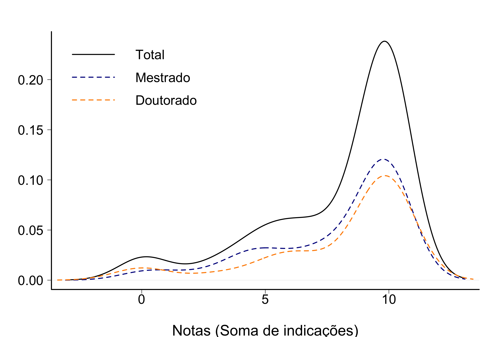
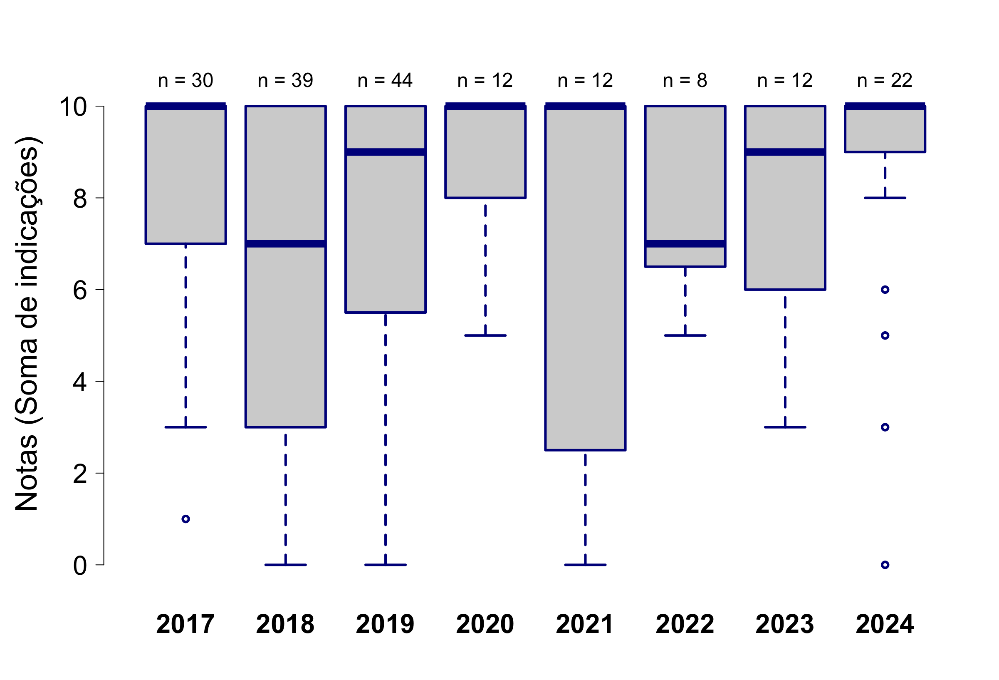
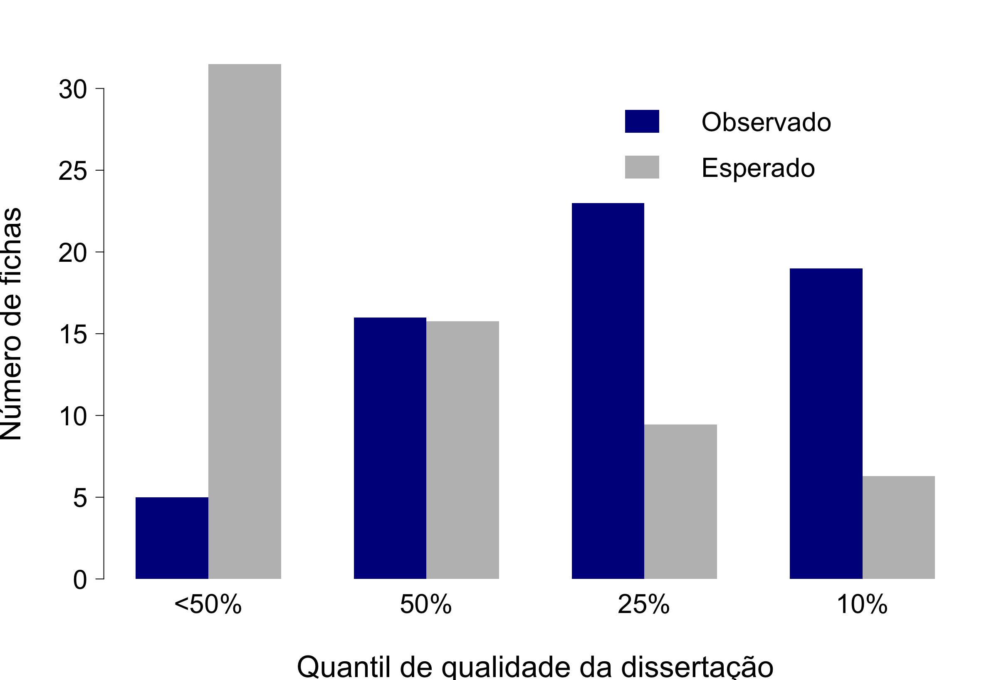
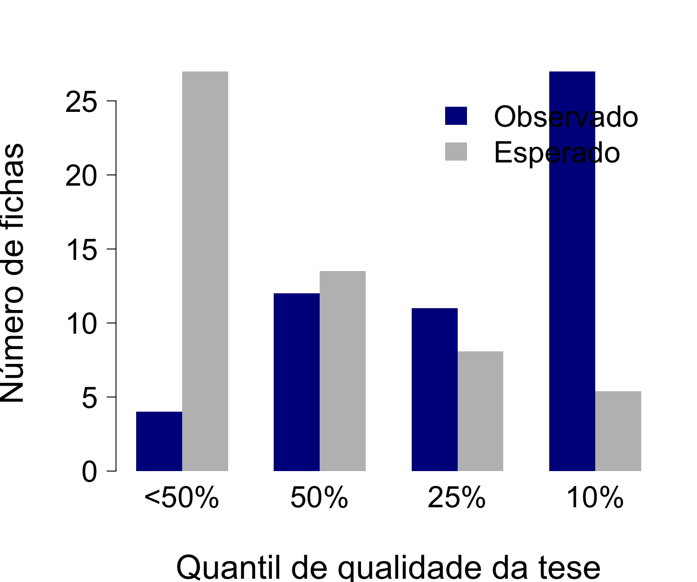
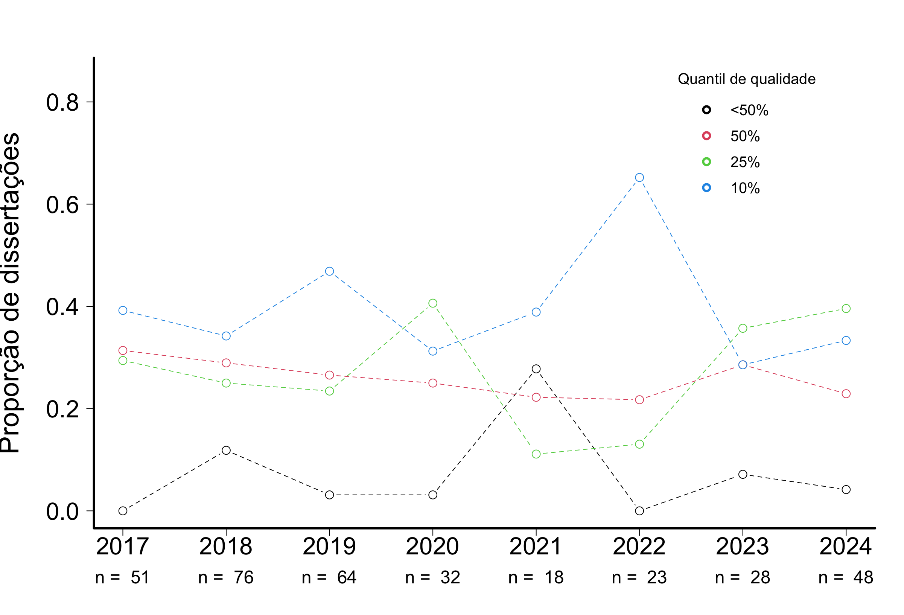
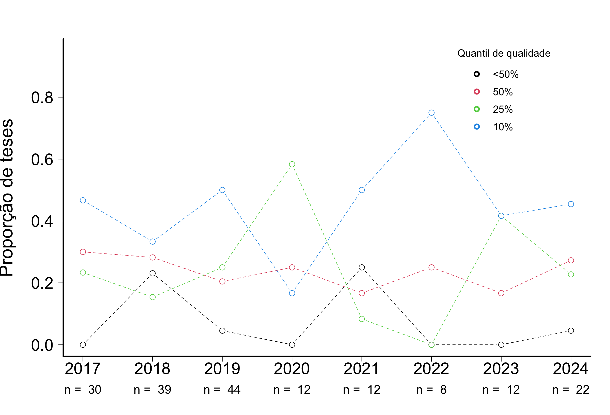
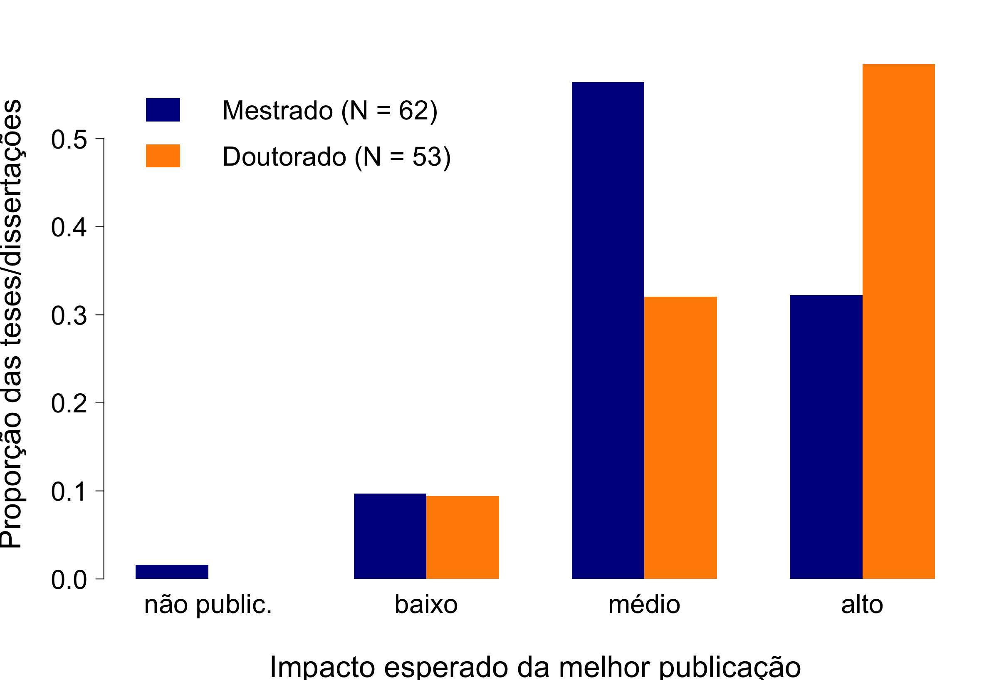
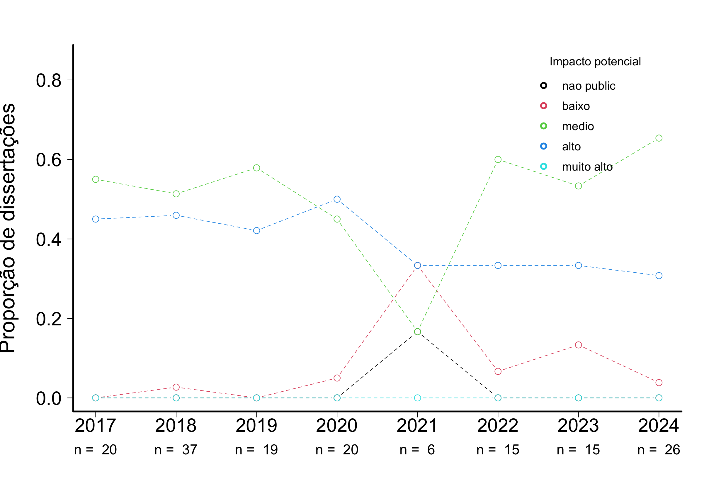
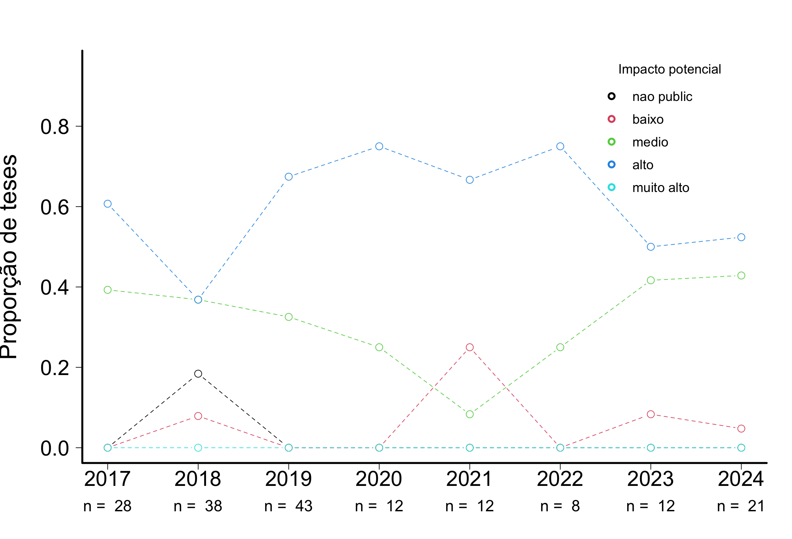

# AVALIAÇÃO DE TESES E DISSERTAÇÕES DO IB-USP 

## GENÉTICA

## Tamanho da amostra

Foram consideradas apenas as fichas das defesas ocorridas no último quadriênio (defesas entre 2021 e 2024)

**Tabela 1.** Número de trabalhos com ao menos uma ficha preenchida  

|                 | Gen|  IB|
|:----------------|---:|---:|
|Mestrado         |  28| 143|
|Doutorado        |  23| 123|
|Doutorado direto |   3|  10|
|Todos cursos     |  54| 276|

**Tabela 2.** Número de fichas  

|                 | Eco|  IB|
|:----------------|---:|---:|
|Mestrado         |  63| 325|
|Doutorado        |  49| 313|
|Doutorado direto |   5|  22|
|Todos cursos     | 117| 660|
 

## Indicadores

Os avaliadores foram perguntados sobre 10 quesitos e foram orientados a indicar quais dos quesitos o trabalho satisfazia de maneira muito boa ou excelente. Os quesitos estão indicados abaixo, com o número de avaliações que julgaram o trabalho com muito bom ou excelente:  

**Tabela 3.** Quesitos indicados como muito bom ou excelente
   
|criterios                                                                          | frequencia| porcentagem|
|:----------------------------------------------------------------------------------|----------:|-----------:|
|Excelencia na redacao                                                              |         94|       80.34|
|Excelencia na contextualizacao teorica                                             |        101|       86.32|
|Excelencia nos objetivos: bem definidos e condizentes com o titulo pleiteado       |        100|       85.47|
|Excelencia nas hipoteses: perguntas e/ou hipoteses sao claras e explicitas         |         94|       80.34|
|Excelencia na originalidade e na relevancia do trabalho                            |         94|       80.34|
|Excelencia nos metodos: bem descritos e adequados para responder a(s) pergunta(s)  |         96|       82.05|
|Excelencia nas analises: bem descritas e adequadas para responder a(s) pergunta(s) |         89|       76.07|
|Excelencia nos resultados: bem apresentados e respondem a(s) pergunta(s).          |         99|       84.62|
|Excelencia na discussao: solida e fortemente alicercada nos resultados obtidos.    |         81|       69.23|
|Excelencia na literatura usada: adequada e atualizada                              |         84|       71.79|

## Notas
Além da análise individual de cada critério, foi realizada também a soma dos aspectos em que a tese/dissertação foi descrita como excelente ou muito boa. As notas de cada tese são as somas do número de indicações por tese/dissertação. Dentre as fichas avaliadas, a média calculada para o curso de Mestrado foi 7.9 (mediana = 9) Doutorado foi 8,0 (mediana = 10).

  
**Figura 1.** Notas calculadas por indicações de teses/dissertações como excelentes ou muito boas. As curvas são kernels de densidade probabilística, uma alternativa preferível a histogramas para representar distribuições de frequência.

  
**Figura 2.** Evolução das notas calculadas por indicações de teses/dissertações como excelentes ou muito boas nos últimos dois quadriênios (entre 2017 e 2024).

  
**Figura 3.** Notas calculadas por indicações de teses/dissertações como excelentes ou muito boas por programa. As curvas são kernels de densidade probabilística.

## Qualidade relativa

A avaliação anônima feita pelos participantes das bancas de defesa, que indicaram a qualidade do trabalho relativa a todos que já orientou ou avaliou, entre quatro classes:

- Abaixo dos 50% melhores que já avaliou/orientou
- Entre os 50% melhores
- Entre os 25% melhores
- Entre os 10% melhores

**Tabela 4.** Qualidade relativa do trabalho (o quesito foi avaliado em 82 fichas)  

|                        | Mestrado| Doutorado| Total|
|:-----------------------|--------:|---------:|-----:|
|Abaixo dos 50% melhores |        4|         4|     8|
|Entre os 50% melhores   |       12|        12|    24|
|Entre os 25% melhores   |       10|        11|    21|
|Entre os 10% melhores   |        2|        27|    29|

  
**Figura 4.** Qualidade relativa - Mestrado. Também indicado o número esperado em cada categoria se o conjunto avaliado e o já conhecido pela banca forem iguais em qualidade. 

 
**Figura 5.** Qualidade relativa - Doutorado. Também indicado o número esperado em cada categoria se o conjunto avaliado e o já conhecido pela banca forem iguais em qualidade. 

### Evolução da Qualidade relativa - Mestrado

  
**Figura 6.** Evolução da qualidade relativa - Mestrado. Evolução da proporção de teses/dissertações defendidas nos dois últimos quadriênios (entre 2017 e 2024) em cada classe de qualidade. 

### Evolução da Qualidade relativa - Doutorado  

  
**Figura 7.** Evolução da qualidade relativa - Mestrado. Evolução da proporção de teses/dissertações defendidas nos dois últimos quadriênios (entre 2017 e 2024) em cada classe de qualidade. 

## Impacto potencial
 
**Tabela 5.** Impacto potencial do trabalho (o quesito foi avaliado em 134 fichas)  

|           | Mestrado| Doutorado| Sum|
|:----------|--------:|---------:|---:|
|nao public |        2|         2|   4|
|baixo      |       33|        10|  43|
|medio      |       35|        52|  87|
|alto       |        0|         0|   0|
|Sum        |       70|        64| 134|

  
**Figura 8.** Proporção de teses e dissertações defendidas entre 2021 e 2024, por classe de impacto. Os participantes das bancas de defesa indicaram o impacto potencial da melhor publicação resultante da tese/dissertação, entre quatro classes: (i) há baixa chance de publicação; (ii) impacto baixo; (iii) impacto médio; (iv) impacto alto.

  
**Figura 10.** Evolução da proporção de teses defendidas entre 2017 e 2024 em cada classe de impacto. 

  
**Figura 11.** Evolução da proporção de dissertações defendidas entre 2017 e 2024 em cada classe de impacto. 

## Comentários

Por fim, no campo para comentários, 78 fichas contém observações, a maioria delas elogiosas, destacando a qualidade da tese. Todas as observações foram transcritas no seguinte formato: **id aluno**: programa: comentário.

**348**: Gen: Apresentação oral excepcional.  
**348**: Gen: Aluno foi extremamente claro e demonstra pleno domínio do assunto abordado. Discutiu com precisão e propriedade todos os levantamentos feitos pela banca. Considerei a defesa da dissertação excelente. Minha única sugestão foi melhorar um pouco a discussão dos resultados.  
**110**: Gen: A resposta 3 está baseada na hipótese, mas o trabalho precisa de experimentos adicionais ainda.  
**426**: Gen: Na verdade, já foi publicado e os estudos derivados poderão ser publicados em revista de alto impacto  
**313**: Gen: Recomenda-se fortemente a atualizacao e revisao detalada de fontes bibliográficas citadas, principalmente na introducao e na discussao. Fiz as sugestoes no PDF do trabalho. 

A redacao do texto mostra parágrafos muito curtos (3-5 linhas) que contiuam idéias de parágrafos anteriores: recomendo revisar isso e juntar num memsmo parágrafo as linhas que falam de uma mesma idéia ou raciocínio.  
**313**: Gen: O trabalho foi realizado com banco de dados primários, e em larga escala, o que dá muita robustez às análises e conclusão dos resultados. Sem dúvida nenhuma um trabalho inédito e que deverá ter uma ótima publicação.  
**484**: Gen: item 3: impacto médio também foi marcado.  
**511**: Gen: O trabalho já foi publicado no periódico Stem Cells International
CiteScore 8.800
Journal Citation Indicator 0.820
Impact Factor 5.131  
**419**: Gen: Os dados apresentados já foram publicados  
**329**: Gen: O formato em artigo é muito bom, mas senti falta de uma introdução geral no qual esperava ler sobre o contexto geral do trabalho, justificativa, objetivos e explicação de como a dissertação estava organizada (capítulos).  
**269**: Gen: Uma dissertação impecável, a aluna e os orientadores estão de parabéns.  
**242**: Gen: Excelente arguição  
**604**: Gen: A tese evidencia que **604** tem todas as qualidades requeridas em um pesquisador.  
**615**: Gen: NA   
**291**: Gen: Excelente trabalho com contribuição original e relevante para a área  
**486**: Gen: A tese está extremamente bem escrita, apresenta resultados importantíssimos sobre os mecanismos de regeneração em aranhas e deve ser considerada para o premio CAPES e divulgação na revista da FAPESP, bem como em outros meios de comunicação relacionados à USP.  
**486**: Gen: Parabéns a doutoranda por toda sua trajetória acadêmica exitosa, pela dedicação. Muito sucesso nos próximos passos.  
**138**: Gen: Por impacto médio entendo FT < 10  
**467**: Gen: Impacto médio também foi marcado  
**333**: Gen: Tese excelente. Recomendo a publicação da tradução comentada em livro e das outras partes em livro ou  em forma de artigos.  
**395**: Gen: Comentários Ilegíveis  
**345**: Gen: Excelente  
**100**: Gen: Candidata demonstrou sólida formação acadêmica e profundo conhecimento do assunto estudado.  
**100**: Gen: Pelo menos 3 artigos em revista de impacto médio a alto.  
**646**: Gen: (Impacto médio) se complementado com outros experimentos  
**457**: Gen: O aluno já publicou grande parte dos trabalhos relacionados ao doutorado!  
**457**: Gen: O aluno está preparado para desenvolver seus trabalhos futuros com independência. Respondeu todo os questionamentos com propriedade.  
**430**: Gen: Como trata-se de dissertação de mestrado ainda não um artigo completo com base nos resultados obtidos, mas já delineia-se base para artigode bom impacto e contribuição para a área caso seja continuado pela aluna/grupo de pesquisa.   
**447**: Gen: Ótima didática na apresentação de seus resultados.  
**447**: Gen: Trabalho excelente!  
**228**: Gen: I am from Uruguay, and although I have participated in other thesis Committees abroad, my experience related to those in Brazil is limited. I think my answers to the questions like the second one here should take this fact into account.  
**85**: Gen: Trabalho excelente, com ótima qualidade científica e muito bem apresentado.  
**578**: Gen: Parabéns pela escolha do tema e a realização do trabalho em tempos de pandemia. Em face à COP-30 que será realizada em Belém, em 2025, o trabalho assume especial relevância.  
**578**: Gen: O manuscrito é bem escrito e se relaciona com a literatura atual sobre o tema e a região. O trabalho realizado por **578**, principalmente no campo, foi de alta qualidade e demonstrou respeito e cuidado com as comunidades com as quais trabalhou. Entendo as razões pelas quais ela decidiu não incorporar os padrões alimentares no manuscrito. Ainda assim, acredito que as suas hipóteses não poderiam ser avaliadas com precisão sem esta informação e outros dados epidemiológicos, que acredito, poderiam ser obtidos em bases de dados nacionais ou postos de saúde locais. Acho que o trabalho dela e o teste de hipóteses seriam fortalecidos com a adição dessas informações contextuais. Por outro lado, a ideia de avaliar a transição nutricional numa comunidade tradicional que experimenta a integração no mercado e no trabalho assalariado, não é particularmente original, embora tenha fornecido muito mais informação contextual do que a maioria dos estudos sobre este processo, e por isso reconheço o valor deste   
**55**: Gen: impacto médio também foi marcado  
**245**: Gen: É uma pós-graduanda excelente.  
**370**: Gen: A aluna já tem 2 artigos publicados e um terceiro artigo da tese já está em R2  
**17**: Gen: Abstract precisa ser revisto profundamente  
**77**: Gen: Tema de pesquisa com muita relevância, a aluna discute seus resultados em forma demasiada suscinta e prefere conclusões. Faltou uma discussão mais abrangente. Os gráficos são de tamanho pequeno e mesmo que foi disponibilizado um PDF, os gráficos são algo importante na tese e portante merecem destaque.  
**103**: Gen: Parabenizo o candidato e orientador pela qualidade do trabalho apresentado.  
**103**: Gen: Trabalhos de biologia báisca não tem impacto imediato.  
**556**: Gen: Trabalho muito bem planejado e executado muito bem efetuado.  
**556**: Gen: impacto médio também foi marcado  
**203**: Gen: Excelente tese, bem escrita, com resultados importante. Recomendo publicação.  
**203**: Gen: Em estado adiantado para publicação.  
**356**: Gen: Impacto alto com algumas modificações sugeridas, o impaco do periodico certamente deve ser mais alto  
**561**: Gen: A tese apresenta muitos problemas referente à metodologia e aplicação da mesma no desenvolvimento da tese. Contém muitas referências de maneira confusa.  
**561**: Gen: A tese foi reprovada por 4 notas a 1, indicando os problemas que esta orientadora tentou corrigir sem sucesso, lamentando profundamente.  
**561**: Gen: Defesa Reprovada  
**561**: Gen: defesa reprovada  
**388**: Gen: Excelente trabalho!  
**548**: Gen: Acredito que a inclusão no título da busca da origem das mutações, enriqueceria o texto.  
**548**: Gen: Item 3: impacto médio também foi marcado.  
**498**: Gen: While the ideia of using seasonal/clinal intersection as a way to test local adaptation is not new, the thesis does represent a novel method and approach to doing so. The analyses are interesting and clearly presented, and the conceptual context is clear. Numerous suggestions were made, but were mostly focused on interpretation. There are centainly a great deal of additional analyses that could be done - these are not necessary for the thesis to stand alone as a substantial body of work, however.  
**335**: Gen: Considerando que é uma tese de mestrado, dificilmente somente os dados de uma tese de mestrado geram publicações de impacto médio a alto.  
**109**: Gen: Há vários dados que não foram apresentados na tese, porém os experimentos/análises foram realizadas. Portanto, o trabalho realizado é até mais robusto que o apresentado na tese. Esses experimentos/análises serão apresentados na publicação.  
**109**: Gen: entre impacot alto e médio  
**572**: Gen: item 3: impacto médio também foi marcado.  
**650**: Gen: Alguns pequenos problemas no texto poderiam ser corrigidos em uma versão retificar da tese  
**339**: Gen: O trabalho se destaca por contemplar bem tanto as áreas de história das ciências e ensino, cumprindo as exigências de ambas as áreas.  
**303**: Gen: Em minha opinião, trata-se de uma importante e original contribuição para o conhecimento da atividade catalítica das peroxidases Ohr, bem como da sua estrutura e distribuição, abrindo a possibilidade do desenho racional de fármacos para inibição das Ohr.  
**303**: Gen: impacto médio também foi marcado  
**283**: Gen: The results have the potential to be published in high impact journal within the field of stem cell biology and tissue engineering. The dissertation is actually amongst the top 2% of similar PhD thesis I have judged over the past 30 years. I would like to formally suggest considering this thesis for the "best PhD thesis 2019" award.  
**283**: Gen: ILEGÍVEL  
**283**: Gen: Trata-se de um aluno excelente que já publicou trabalhos como primeiro coautor em revistas de alto impacto. Além disso, colabora com todos os colegadas em todos os aspectos que possam aprimorar a pesquisa cientifica.  
**543**: Gen: O trabalho de dissertação produziu dados novos, com grande potencial de publicação em periódico internacional. A inclusão de análises adicionais, como um grupo de validação externo, aumentará as chances de publicação e seu impacto. 
Merece ser destacado que o estudo forneceu evidências importantes que implicam novos sítios e regiões diferencialmente metiladas associadas a genes potencialmente envolvidos na hipertensão arterial. 
Esses achados poderão ser alvo de pesquisas promissoras baseadas em ensaios funcionais e delineadas para desvendar os mecanismos etiopatogenéticos dessa condição.  
**543**: Gen: A dissertação contribui significativamente para o entendimento da arquitetura genética de fatores de risco cardiovascular em populações miscigenadas. Os resultados poderão ser publicados em periódico de alto impacto com a condução de análises adicionais, conforme sugerido pela banca examinadora.  
**464**: Gen: Seria publicado em periódico de impacto baixo, mas de qualidade, apenas por se tratar de um tema em um grupo de animais muito especializado.  
**299**: Gen: Trata-se de um dissertação original, de grande impacto social.  
**524**: Gen: Objeto de estudo de grande importância e estudos realizados com bastante critério e metodologias adequadas. Com alguns experimentos adicionais é possível gerar um artigo publicado em uma revista de grande impacto e prestígio.  
**593**: Gen: The thesis was well designed but poorly executed. While the generated data themselves are relevant for the Prehistory of the region, they were overinterpreted and used to portray a picture of territorial mobility of Early Holocene populations that can´t be at all sustained with the current data. The results were inadequatly presented and the discussion was very superfictial. The Master student did not carry out the laboratory work herself.  
**593**: Gen: A discente apresentou revisão bibliográfica incompleta e cujos temas não apresentam conexão clara com os resultados obtidos. Uma vez que a discente, por razões diversas, não conseguiu acompanhar a seleção dos materiais e seu processamento em laboratório, ela deveria, no mínimo, ter feito uma boa análise dos resultados. No entanto, ela usou teste estatístico inadequado para sua amostra (de acordo com ela, a sugestão de uso desse teste foi dada pelo co-orientador), prejudicando seriamente a interpretação dos resultados. Em suma, o trabalho não pode ser publicado nessa versão apresentada e a banca sugeriu veementemente que a discente incorpore as sugestões dadas pela banca na versão final a ser depositada na biblioteca do IB.  
**164**: Gen: O artigo já foi publicado em revista de impacto alto (Humam Molecular Genetics) e um segundo artigo já foi aceito para publicação. Além disso, o aluno já publicou diversos artigos como primeiro autor que estão listados na sua tese de doutorado.  
**374**: Gen: Resultados intermediários da análise computacional deveriam ter sido apresentados  
**108**: Gen: O candidato apresenta uma riqueza de dados e análises que conferem ao projeto um excelente nível de discussão sobre suas implicações. Considero também que o estudo é inovador e uma grande contribuição para a toxinologia mundial.  
**108**: Gen: Com um pouco mais de resultados, resolvendo alguns problemas experimentais, os resultados poderiam ser publicados em revista de alto impacto, pois traz novidades do ponto de vista biológico.  
**47**: Gen: Excelente trabalho, muito bem feito, muito bem escrito. Parabéns aos envolvidos!  
**62**: Gen: Desde que parte do N amostral seja aumentado, o trabalho tem perspectivas de publicação em revistas de alto e médio impacto.

