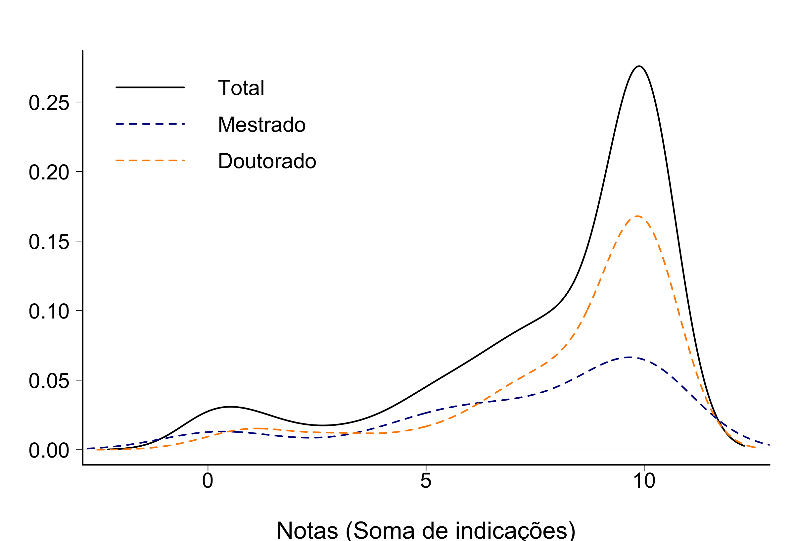
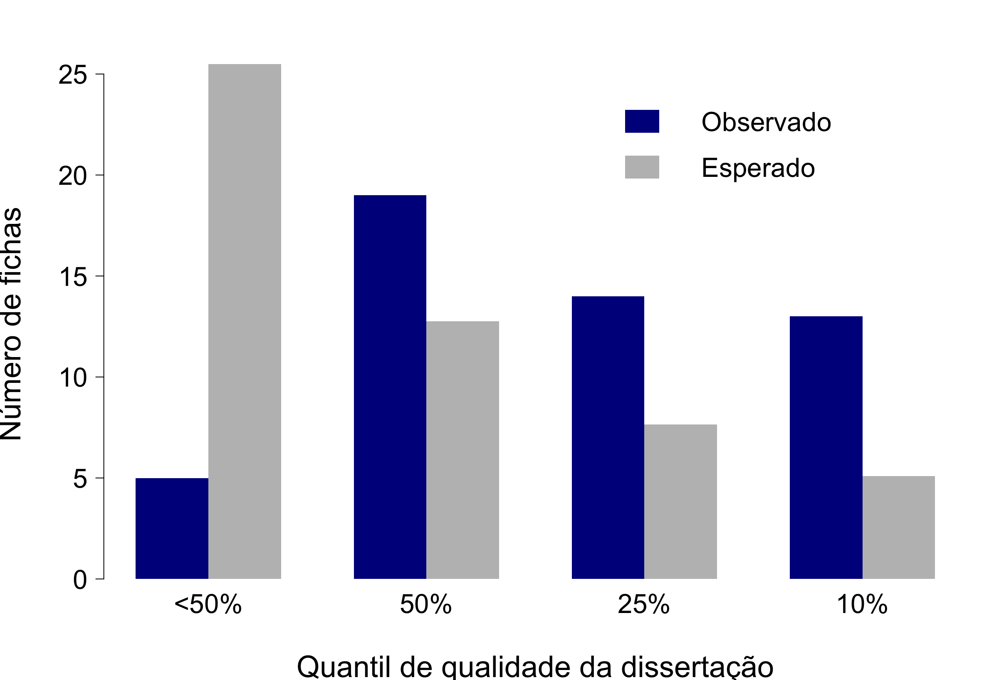
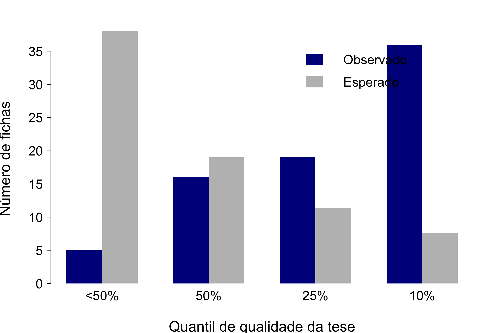
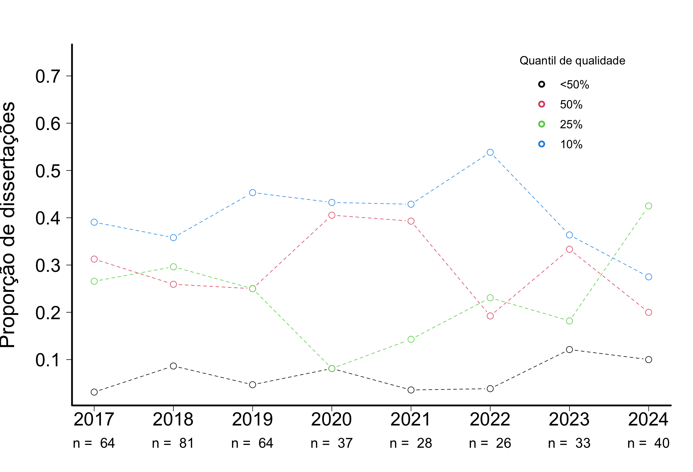
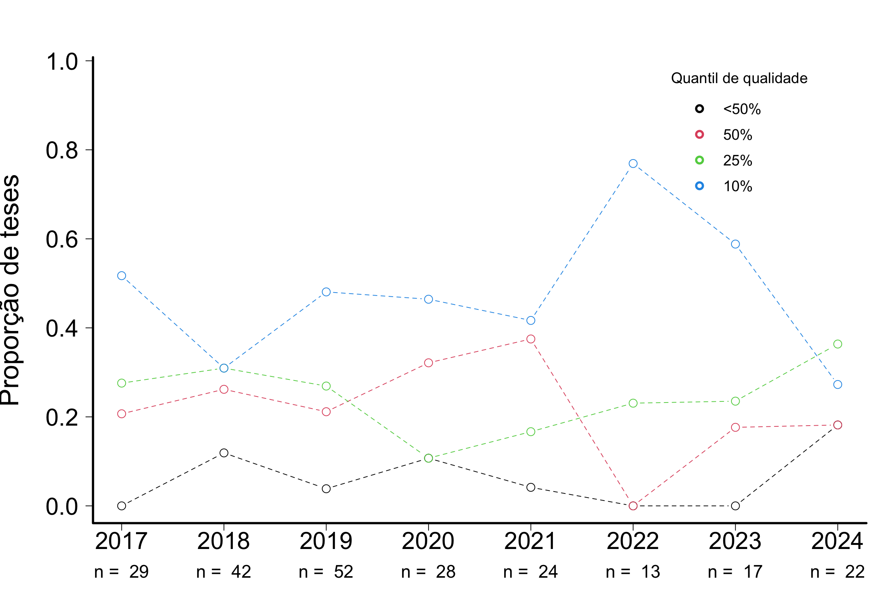
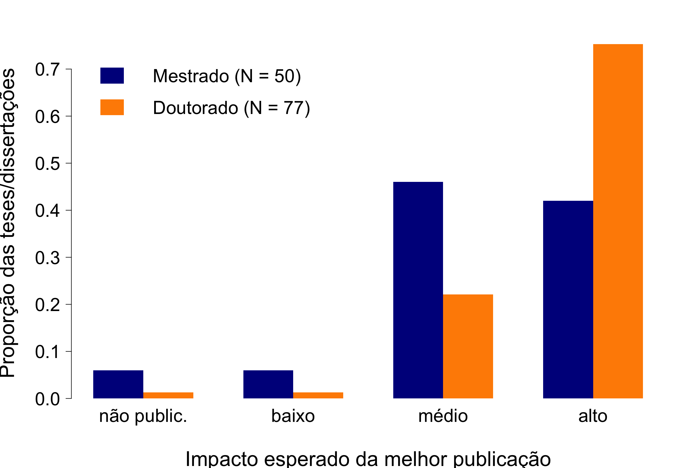
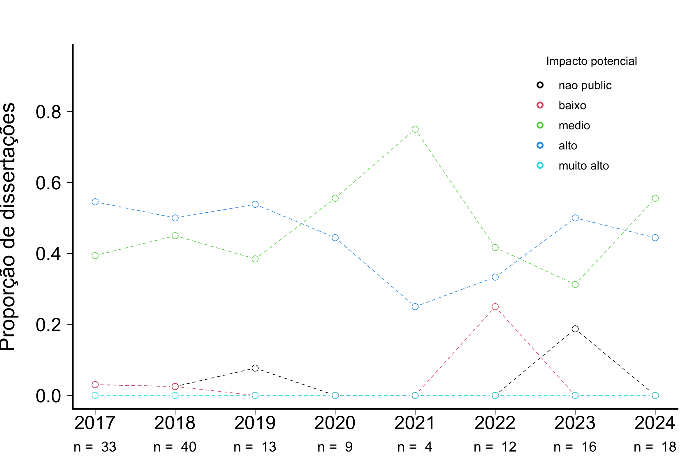
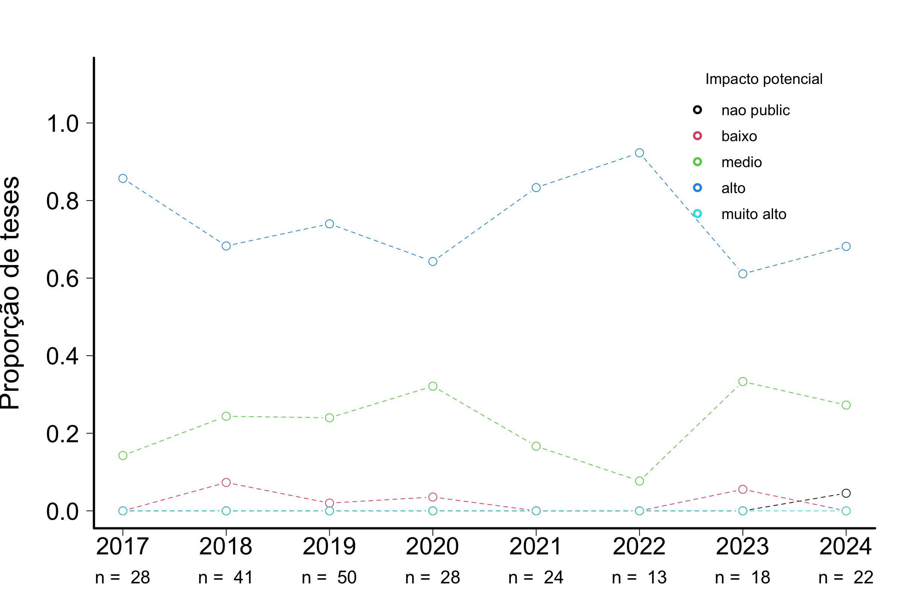

# AVALIAÇÃO DE TESES E DISSERTAÇÕES DO IB-USP 

## ZOOLOGIA

## Tamanho da amostra

Foram consideradas apenas as fichas das defesas ocorridas no último quadriênio (defesas entre 2021 e 2024)

**Tabela 1.** Número de trabalhos com ao menos uma ficha preenchida  

|                 | Zoo|  IB|
|:----------------|---:|---:|
|Mestrado         |  26| 143|
|Doutorado        |  24| 123|
|Doutorado direto |   1|  10|
|Todos cursos     |  51| 276|

**Tabela 2.** Número de fichas  

|                 | Zoo|  IB|
|:----------------|---:|---:|
|Mestrado         |  51| 325|
|Doutorado        |  73| 313|
|Doutorado direto |   4|  22|
|Todos cursos     | 128| 660|
 

## Indicadores

Os avaliadores foram perguntados sobre 10 quesitos e foram orientados a indicar quais dos quesitos o trabalho satisfazia de maneira muito boa ou excelente. Os quesitos estão indicados abaixo, com o número de avaliações que julgaram o trabalho com muito bom ou excelente:  

**Tabela 3.** Quesitos indicados como muito bom ou excelente
   
|criterios                                                                          | frequencia| porcentagem|
|:----------------------------------------------------------------------------------|----------:|-----------:|
|Excelencia na redacao                                                              |        100|       78.12|
|Excelencia na contextualizacao teorica                                             |        107|       83.59|
|Excelencia nos objetivos: bem definidos e condizentes com o titulo pleiteado       |        103|       80.47|
|Excelencia nas hipoteses: perguntas e/ou hipoteses sao claras e explicitas         |         96|       75.00|
|Excelencia na originalidade e na relevancia do trabalho                            |        110|       85.94|
|Excelencia nos metodos: bem descritos e adequados para responder a(s) pergunta(s)  |        106|       82.81|
|Excelencia nas analises: bem descritas e adequadas para responder a(s) pergunta(s) |         93|       72.66|
|Excelencia nos resultados: bem apresentados e respondem a(s) pergunta(s).          |         99|       77.34|
|Excelencia na discussao: solida e fortemente alicercada nos resultados obtidos.    |         86|       67.19|
|Excelencia na literatura usada: adequada e atualizada                              |        112|       87.50|

## Notas
Além da análise individual de cada critério, foi realizada também a soma dos aspectos em que a tese/dissertação foi descrita como excelente ou muito boa. As notas de cada tese são as somas do número de indicações por tese/dissertação. Dentre as fichas avaliadas, a média calculada para o curso de Mestrado foi 7.3 (mediana = 8) Doutorado foi 8,3 (mediana = 10).

  
**Figura 1.** Notas calculadas por indicações de teses/dissertações como excelentes ou muito boas. As curvas são kernels de densidade probabilística, uma alternativa preferível a histogramas para representar distribuições de frequência.

  
**Figura 2.** Evolução das notas calculadas por indicações de teses/dissertações como excelentes ou muito boas nos últimos dois quadriênios (entre 2017 e 2024).

  
**Figura 3.** Notas calculadas por indicações de teses/dissertações como excelentes ou muito boas por programa. As curvas são kernels de densidade probabilística.

## Qualidade relativa

A avaliação anônima feita pelos participantes das bancas de defesa, que indicaram a qualidade do trabalho relativa a todos que já orientou ou avaliou, entre quatro classes:

- Abaixo dos 50% melhores que já avaliou/orientou
- Entre os 50% melhores
- Entre os 25% melhores
- Entre os 10% melhores

**Tabela 4.** Qualidade relativa do trabalho (o quesito foi avaliado em 127 fichas)  

|                        | Mestrado| Doutorado| Total|
|:-----------------------|--------:|---------:|-----:|
|Abaixo dos 50% melhores |        5|         5|    10|
|Entre os 50% melhores   |       19|        16|    35|
|Entre os 25% melhores   |       14|        19|    33|
|Entre os 10% melhores   |       13|        36|    49|

  
**Figura 4.** Qualidade relativa - Mestrado. Também indicado o número esperado em cada categoria se o conjunto avaliado e o já conhecido pela banca forem iguais em qualidade. 

 
**Figura 5.** Qualidade relativa - Doutorado. Também indicado o número esperado em cada categoria se o conjunto avaliado e o já conhecido pela banca forem iguais em qualidade. 

### Evolução da Qualidade relativa - Mestrado

  
**Figura 6.** Evolução da qualidade relativa - Mestrado. Evolução da proporção de teses/dissertações defendidas nos dois últimos quadriênios (entre 2017 e 2024) em cada classe de qualidade. 

### Evolução da Qualidade relativa - Doutorado  

  
**Figura 7.** Evolução da qualidade relativa - Mestrado. Evolução da proporção de teses/dissertações defendidas nos dois últimos quadriênios (entre 2017 e 2024) em cada classe de qualidade. 

## Impacto potencial
 
**Tabela 5.** Impacto potencial do trabalho (o quesito foi avaliado em 127 fichas)  

|           | Mestrado| Doutorado| Sum|
|:----------|--------:|---------:|---:|
|nao public |        3|         1|   4|
|baixo      |        3|         1|   4|
|medio      |       23|        17|  40|
|alto       |       21|        58|  79|
|Sum        |       50|        77| 127|

  
**Figura 8.** Proporção de teses e dissertações defendidas entre 2021 e 2024, por classe de impacto. Os participantes das bancas de defesa indicaram o impacto potencial da melhor publicação resultante da tese/dissertação, entre quatro classes: (i) há baixa chance de publicação; (ii) impacto baixo; (iii) impacto médio; (iv) impacto alto.

  
**Figura 10.** Evolução da proporção de teses defendidas entre 2017 e 2024 em cada classe de impacto. 

  
**Figura 11.** Evolução da proporção de dissertações defendidas entre 2017 e 2024 em cada classe de impacto. 

## Comentários

Por fim, no campo para comentários, 88 fichas contém observações, a maioria delas elogiosas, destacando a qualidade da tese. Todas as observações foram transcritas no seguinte formato: **id aluno**: programa: comentário.

**50**: Zoo: There is considerable overlap among chapters with the phylogenomic analyses, with each chapter focusing on phylogenetic placemente of a particlar clade or family. Some of these clades are not included in the analyses of another clade, despite the fact that incomplete taxon sampling may impact inferences avout phylogenetic relationships. it is not clear why the same phylogeny cannot be used for all of the as-yet-unpublished chapters.

[Há uma sobreposição considerável entre os capítulos com as análises filogenômicas, com cada capítulo enfocando a localização filogenética de um clado ou família específico. Alguns desses clados não estão incluídos nas análises de outro clado, apesar do fato de que a amostragem incompleta de táxons pode impactar as inferências sobre as relações filogenéticas. não está claro por que a mesma filogenia não pode ser usada para todos os capítulos ainda não publicados.]  
**50**: Zoo: There is considerable overlap among chapters in the phylogenomic analyses, with each chapter focusing on phylogenetic placement of a particular clade or family. Some of these clades are not included in the analyses of another clade, despite the fact that incomplete taxon sampling may impact inferences about phylogenetic relationships. It is not clear why the same phylogeny cannot be used for all of the as-yet-unpublished chapters.  
**265**: Zoo: Publicação altamente recomendada!  
**265**: Zoo: O trabalho apresenta revisão e filogenia inédita em Diplópodos, ampliando o conhecimento deste grupo.  
**619**: Zoo: I would have preferred to have a second analysis to corroborate the first. While I think the study is a good Master thesis, in order to publish the data it will require additional data and could benefit from collaborations with other labs  
**123**: Zoo: O candidato e o orientador estão de parabéns pelo excelente estudo realizado e pelo documento apresentado  
**2**: Zoo: O texto se beneficiaria com a redução do conteúdo pouco pertinente em relação aos objetivos do estudo. Além disso, é necessário aprimorar a definição das perguntas e das expectativas em relação aos resultados. Na discussão dos achados, o discente deve integrar mais os resultados genéticos e de modelagem de nicho ecológico para fortalecer o argumento em relação às questões de pesquisa propostas. 
Para melhorar a compreensão do leitor, sugiro que o discente coloque as figuras mais importantes, que são fundamentais para sustentar sua argumentação, no meio do texto, transferindo todas as outras figuras (que são numerosas) para a seção de material suplementar.  
**71**: Zoo: A dissertação está muito bem elaborada, já no formato de 2 artigos em língua inglesa. Vai se beneficiar de alguns ajustes, mas nada que comprometia a qualidade geral do trabalho.  
**64**: Zoo: impacto médio também foi marcado  
**64**: Zoo: impacto médio também foi marcado  
**332**: Zoo: I was impressed by the outstanding quality of the work  
**332**: Zoo: Já completamente publicado.  
**13**: Zoo: Veja comentários "outros", na página anterior.  
**375**: Zoo: Gostaria de salientar a importância da viagem ao exterior, quando o aluno pode ter contato com outros pesquisadores e também com todo o material-tipo do grupo de estado. Isso fica evidente no resultado final do seu projeto.  
**506**: Zoo: Trabalho de altissíma qualidade.  
**412**: Zoo: Já publicados  
**608**: Zoo: impacto médio também foi marcado  
**117**: Zoo: O  trabalho NA um grupo importante de NA e deve ser publicado após menores ajustes.  
**179**: Zoo: O projeto original foi desativado após um ano pois um pesquisador estrangeiro passou a descrever diversas espécies relacionadas com a revisão proposta. Portanto, o projeto defendido foi desenvolvido em pouco mais de 3 anos, incluindo o desenvolvido no exterior.  
**628**: Zoo: A tese é excelente, bem escrita e revela claramente a qualidade dos projetos, desde o delineamento até a execução e interpretação dos resultados. O capítulo de revisão já está publicado em revista de alto impacto, enquanto os outros três capítulos estão ou submetidos ou em fase avançada de redação e naturalmente também serão publicados em bons periódicos científicos. Parabenizo os pesquisadores pelo trabalho realizado, ainda mais em meio a um período de incertezas geradas pela pandemia e por instabilidades políticas e econômicas do país.  
**611**: Zoo: A tese está muito boa e bem redigida!  
**170**: Zoo: O candidato em questão foi extremamente dedicado ao longo do seu doutorado produzindo 8 (oito) capítulos muito bem embasados, sendo três deles já publicados em excelentes períodicos.  
**170**: Zoo: Trata-se de um trabalho excelente, muito bem orientado, finalizado com publicação inclusive. Excelente! Recomendo considerar como uma tese a ser eleita como a melhor da PPG-Zoologia-USP.  
**552**: Zoo: Trata-se de uma tese de excelente nível finalizada com uma grande quantidade de dados inéditos, obtidos por metodologia adequada e redigida de forma a ser prontamente enviada à publicação. Aluna e Orientador estão de parabéns pelo trabalho desenvolvido.  
**296**: Zoo: O trabalho de alta qualidade, resultará em publicações muito imporantes na área.  
**171**: Zoo: impacto médio também foi marcado  
**78**: Zoo: impacto alto: cap 1, impacto médio: cap 2. item 4: "O cap 2: bem contextualizado; obj. bem def.; perg. e hipóteses claras; métodos adequados; análise e resultados, bem apresentados/discutidos; literatura adequada."  
**78**: Zoo: impacto médio também foi marcado. comentário item 4: O trabalho é dividido em 3 capítulos, que resultarão em 2 publicações com impactos distintos.  
**465**: Zoo: TEXTO DE DIFICIL COMPREENSÃO  
**465**: Zoo: A dissertação aborda um tema escassamente conhecido como é a resposta a estímulos químicos por Opilones (Arachmida). Nesse sentido é anpinal (sic) e com alto graude de novidade. Entretanto o volume de resultados ainda é escasso para atingir conclusões bem sustentadas e confiáveis.  
**86**: Zoo: comentário no item 3: desde que acertasse algumas deficiências. Comentário item 4: É necessário melhorar as descrições e ilustrações dos caracteres. É necessário explicar as hipóteses de homologia.  
**397**: Zoo: O artigo tem boas chances de ser publicado num jornal de impacto médio, mas precisa uma forte reestruturação, uma reanalises de pontos relevantese fundamentais como a homologia e definição de morfocaracteres.  
**167**: Zoo: Tese extremamente bem redigida e organizada. Excelente conteúdo, alta qualidade e forma de apresentação.  
**560**: Zoo: O trabalho precisará sofrer alguns ajustes na descrição da metodologia e nas análises estatísticas para aumentar as chances de publicação com tais adaptações, tenho certeza que os manuscritos serão publicaveis.  
**12**: Zoo: Os resultados do cap. 1 e cap. 2 podem ser melhorados na apresentação e análise.  
**478**: Zoo: Impacto médio por ser de um grupo pouco explorado na região neotropical. Seria alto se bem conhecido e chamaria mais atenção. A parte taxonomica poderia estar melhor discutida e organizada  
**478**: Zoo: O trabalho é bastante relevante e importante para o grupo estudado,  porém na forma como foir apresentado acaba reduzindo a qualidade da tese apresentada.  
**523**: Zoo: Vai ser enviado para uma revista de excelencia  
**523**: Zoo: Ótimo trabalho, recomendo para publicação  
**512**: Zoo: (impacto médio) após correções  
**567**: Zoo: impacto baixo também foi marcado  
**617**: Zoo: A aluna cumpre com todos os requisitos para obter o título de doutora em ciências (áreas zoologia).  
**209**: Zoo: comentário item 3: entre médio e alto  
**209**: Zoo: Minha estudante, então posso estar enviesado.  
**209**: Zoo: A tese tem uma quantidade enorme de trabalho, muito bem feito, mas há várias falhas de forma, erros ou omissões de (ou em) legendas, texto repetitivo. Nada que comprometa de qualquer maneira a qualidade científica ou acadêmica. Alguns métodos não estão bem descritos, também.  
**80**: Zoo: The thesis was a pleasure to read: excellent writing, deep scholarship, beaituful figures, clear logic. I would like to see a bit more information about how the PC. hypothesis for Arella  tests might be tested not clear to me the specifics of what the author(s) have in mind. Otherwise, a top-quality thesis!  
**80**: Zoo: O trabalho apresenta alta qualidade e relevância para a ciência. Além disso, o aluno **80** apresentou sua dissertação com segurança, confiança e mostrou claro domínio do tema.   
**549**: Zoo: O manuscrito está solidamente embasado em teoria, possui um desenho experimental adequado, apresenta resultados claros e discussão pertinente. Por isso, mesmo sendo um trabalho experimental realizado com uma população, considero que o manuscrito tem boas chances de publicação em periódicos de comportamento animal ou ecologia comportalmental.  
**317**: Zoo: A candidata respondeu com segurança todos os questionamentos da banca, demonstrou domínio do seu trabalho, o qual findou na sua tese. Assim, a Sra. **317** apresenta todos os requisitos para a obtenção do título de Doutor em Ciências Biológicas, área de Zoologia.  
**476**: Zoo: A tese merece destaque por ser composta de 3 capítulos, sendo 2 já publicados. Isto demonstra a organização da tese em experimentos com começo, meio e fim muito claros e bem planejados. Parabenizo o discente e o orientador pelo feito.  
**521**: Zoo: Alto impacto após complementação e melhorar discussão.  
**234**: Zoo: Não estou capacitado para avaliar se a literatura é pertinente e atualizada  
**234**: Zoo: Tese muito bem escrita e de extrema relevante (sic) para a área de parasitologia. Excelente trabalho da pesquisadora **234**. O trabalho apresentado pela **234** está acima da média e deve servir de exemplo dentro do programa.  
**42**: Zoo: O trabalho é inédito e traz questões interessantes sobre um grupo bastante interessante de peixes marinhos, com diversas espécies ameaçadas de extinção. A hipótese levantada e os objetivos estão bem claros. Entretanto, o trabalho apresenta muitos problemas na escrita e nas ilustrações. A bibliografia está desatualizada. Faltaram alguns cuidados para que o trabalho se torne uma referência na área.  
**42**: Zoo: O tema abordado na presente tese é extremamente relevante e foi abordado de forma adequada. Os problemas encontrados na tese não tiram o mérito do estudo e são até esperados em um trabalho desta magnitude, de sorte que não configuram razão suficiente para impedir a aprovação do candidato.  
**42**: Zoo: O estudo em questão é relevante e representa um problema taxonômico relativamente intrincado, de modo que o autor da dissertação demonstrou deisposição e coragem intelectual para abordar tal assunto e, em face a isso, ainda obter resultados interessantes, como o reconhecimento de um espécie não descrita. Os procedimentos taxonômicos adotados no trabalho são de maneira geral adequados e o projeto foi enriquecido com um estudo osteológico. Por sua vez, parte dos resultados obtidos é um pouco mais discutível em virtude da complexidade do tema, porém eu senti falta de uma discussão mais elaborada dos táxons e, se possível, também do uso de outros caracteres morfologicos. Além disso, o texto e a organização da dissertação não estavam totalmente satisfatórios e comprometeram um pouco o resultado final do trabalho.  
**75**: Zoo: A aluna vem em trajetória de grande dedicação à linha de estudo. Possuindo sólida bagagem acadêmica e domínio do tema.  
**649**: Zoo: A tese está bem escrita, clara, concisa e já em forma de artigos, o que facilitará a publicação dos mesmos. Dois artigos tem potencial para ser publicado em revistas B1 e B2, e um deles (cap. III) em revistas A1, A2 ou B1. Em relação às críticas, há grande quantidade de artigos "in prep." citados, inclusive espécies novas in prep. Sugiro melhorar isso para evitar problemas.  
**190**: Zoo: O trabalho é de muita qualidade, benfeito e prazeroso de ler. e a aluna demostra dedicação enexaurível e muita comptência. Os erros a ser apontados na tese e na arguição são esperados de uma pesquisa dessa magnitude. A candidata está apta a perpetuar o legado de seus orientadores ao conhecimento da sistemática dos Chondrichthyes.  
**220**: Zoo: Creo que el trabajo morfológico es muy extenso  
**220**: Zoo: A tese foi bem construída, com muitos dados para análise filogenética. Os resultados são amplos e inéditos para família Anyphaenidae, já que Anyphaeninae nunca foi analisada na linha cladística.  
**591**: Zoo: O trabalho é de boa qualidade e contribui para o conhecimento de fitotelmatas na região Neotropical. Há uma contribuição especialmente taxonômica nesse trabalho, adicionando informações para a correta identificação desses organismos. A meu ver as descrições das espécies novas apresentadas são de boa qualidade e poderão ser submetidos em curto prazo de tempo apra revistas da área. O melhor artigo que achei foi a respeito da filogenia, o último. Porém, creio que para ser publicado em uma revista A2 ou A1, recomendo que sejam incluídos mais táxons ou dados moleculares, com abordagens biogeográficas se possível, fazendo assim uma análise encima de hipóteses mais profundas. Contudo entendo a dificuldade a ser encontrado ao trabalhar com análises moleculares desses organismos pelo pequeno tamanho e pela falta de material fresco de outros países devido a burocracia e distância geográfica.  
**591**: Zoo: Artigos relacionados a taxonomia morfológica descrição de novas espécies são reelevantes, no entanto, as revista que publicam tais trabalhos não possuem impacto elevado. Quando adicionados análise molecular (taxonomia morfológica + taxonomia molecular) englobando a diversidade taxonomica e diversidade genética, o cenário muda. Este trabalho contribui para o enriquecimento da biodiversidade, consequentemente pode fornecer informações relevantes para a conservação de espécies e ecossistema.  
**591**: Zoo: Apresentação concisa, clara, bem montada. Ilustrações de excelente qualidade, tanto desenhos como fotos de MEV. Esclareceu todas as dúvidas da banca. Demonstrou conhecimento tanto especifico de suas áreas especificas como de áreas correlatas.  
**142**: Zoo: O estudo foi baseado em dissertações e teses que não foram publicados, e pelo que foi explicado a este avaliador no momento da defesa, foram baseados em banco de disados disponível a um grupo de pesquisadores, e que não é publico ou foi disponibilizado em forma de publicação. Isso, afeta diretamente a finalização e pode inclusive impedir a sua publicação.
Embora a ideia seja muito boa e a quantidade de dados obtidos na dissertação seja suficiente para algumas publicações, as análises que foram realizadas não permitem alcançar um dos objetivos e para este avaliador, foram efetivadas de forma equivocada. Isso acarretou em dificuldades na organização dos resultados e discussão.
Há uma certa subjetividade em diversos pontos do estudo, que foi observada pela banca avaliadora, a qual sugeriu diversas mudanças e correções.
Como uma sugestão ao PPG para evitar tais condições, e logicamente de alguém que participou pontualmente de um evento, seria o acompanhamento de mestrandos em ao decorrer do seu tempo no PPG, exigindo que as metas estabelecidas no projeto estejam de acordo com o cronograma proposto. PPG, exigindo que as metas estabelecidas no projeto estejam de acordo com o cronograma proposto.
De forma geral, foi um estudo bom, mas que merece ainda muito atenção para sua preparação final, e certamento o orientador terá todas as ferramentas para tal.
Ainda, seria bom o avaliador externo obter todas as informações necessárias dos procedimentos a serem realizadas na banca com certa antecedência, tal como tempo para discussão, se existe alguma planilha a ser preenchida, forma de avaliação e etc. Quase todas essas informações foram obtidas no momento da defesa.
Ainda, sugiro que ao serem convidados avaliadores de localidades distantes de aeroportos e grandes centros, estes tivessem uma atenção quanto ao seu deslocamento para fora de seu domicílio. A colaboração com qualquer PPG, parcipando de bancas de avaliação é claramente uma das melhores formas de interação na ciência, principalmente em se tratando desta instituição de renome. No entanto, torna-se em lagumas ocasiões de extremo esforço para o avaliador, o qual poderia ser amenizado com auxílio dos serviços administrativos do PPG. Agradeço a oportunidade de interação com o IB e espero que tais sugestões colaborem para a melhoria dos PPGs.  
**36**: Zoo: A tese é composta de três capítulos, sendo que o 1o já foi publicado em revista A1, o 2o foi submetido/está em revisão, e o 3o deverá gerar outra publicação importante.  
**562**: Zoo: A tese não só apresenta resultados possíveis de publicações de alto impacto como é possível prever outros importantes desdobramento dos resultados e dados ai apresentados, que com certeza resultarão em outros importantes trabalhos e no estabelecimento de uma importante linha de pesquisa na carreira do autor da tese.  
**252**: Zoo: Como disse antes, grupo pouco estutado no país e é um aluno em formação neste ramo da zoologia.  
**201**: Zoo: I thought the project was fantastic and the thesis demonstrated the years of hard work that was put into collecting and analyzing the data. I feel that the writing would have been slightly improved with another round of revision to correct the numerous minor mistakes (typos and grammar). However, the quality of the research is not diminished by the minor mistakes of the thesis!  
**201**: Zoo: This work will become an important and significant scientific and taxonomic work on the third  largest family of Opiliones. The results of interesting and novel. My only minor comments are that scientific names, especially genera, are italicized where appropriate and that adjective forms of nouns be used more consistently in some of the text. SEM paltes are of high quality.  
**279**: Zoo: O documento possui problemas onde será sugerido que o aluno apresente um novo documento com correções em um prazo de 60 dias.  
**279**: Zoo: Como está não gera publicações  
**279**: Zoo: TEXTO INCOMPREENSÍVEL 
**693**: Zoo: Recomendo que a candidata aprovada reveja o texto da tese antes de depositar a versão final.  
**314**: Zoo: A tese pode atingir um impacto alto mas somenete depois de muita revisão e reanalise dos dados.  
**314**: Zoo: Revisar las carácteres de tricobothrias y carenas del metosoma para mejorar los estados de caracteres y aumentar el número de caracteres, eso poderia ser cambinar la topologia del árbol.  
**462**: Zoo: Um ótimo trabalho, de alto padrão, que certamente produzirá excelentes publicações. Parabéns ao autor da tese e ao seu diretor!  
**462**: Zoo: Es un trabajo muy importante y de alto impacto para la escorpiologia neotropical, con proyecciones tambien en el campo de la salud publica.  
**495**: Zoo: Os resultados obtidos pelo candidato são extremamente importantes e deverão ser ampliados para a continuidade dos trabalhos de carater taxonômico.  
**495**: Zoo: Há uma certa confusão na literatura sobre os tipus de tuberculus do cerpo. Conclui-se que só exise um tipo de projeção do corpo. Há uma boa aplicação de técnicas modernas de estudo (tomografia). O aluno publicou dois trabalhos no grupo, habilitando-o a ser considerado um dos únicos especialistas ativos no grupo na América do Sul.  
**495**: Zoo: O trabalho vem a suprir uma lacuna muito grande de um grupo importante, mas que carece muito de especidista(?) e trabalhos na área, especialmente no país.  
**247**: Zoo: Conforme foi possível perceber através das falas do aluno **247** durante a defesa, durante o doutorado ele realizou um estudo muito aprofundado e obteve um grande volume de dados. No entando, o aluno teve problemas para transpor grande parte de seus resultados para a teses, o que resultou em um trabalho bastante aquém do que poderia ter sido apresentado. Dessa forma, a comissão julgadora solicitou a elaboração de uma versão corrigida da tese, dando ao aluno a oportunidade de melhorar significativamente a qualidade do documento a ser entregue.  
**247**: Zoo: A tese apresenta um problema claro e objetivo do ponto de vista da sistemática de Orthoptera. Verifica-se que o discente se dedicou integralmente ao desenvolvimento da pesquisa e que possui resultados de qualidade. A tese possui deficiências que devem ser corrigidas para a versão final, as quais foram pontuadas e discutidas, na arguição do discente pela banca examinadora, durante a defesa.  
**193**: Zoo: Uma tese muito sólida que abrange um grande número de espécies. Uma contribuição incrível para a biodiversidade da Mata Atlântica e para a taxonomia dos platelmintos. Meus mais sinceros parabéns ao diretor de tese e seu aluno de doutorado.  
**136**: Zoo: A dissertação apresenta um tema de grande relevância e importância para a resolução do grupo. O trabalho necessita de algumas alterações e após as devidas correções poderá gerar uma boa publicação. O candidato apresentou maturidade e conhecimento suficiente para ser aprovado.  
**98**: Zoo: Publicação fortemente sugerida! Trabalho de referência para o grupo taxômico!  
**98**: Zoo: É um trabalho inédito em um grupo negligenciado a muito tempo. Esta contribuição é uma das elhores entre os estudos ILEGÍVEL.  
**98**: Zoo: O trabalho atendeu a todos os requisitos de uma tese de doutorado. Apresenta qualidade acima da média.  

