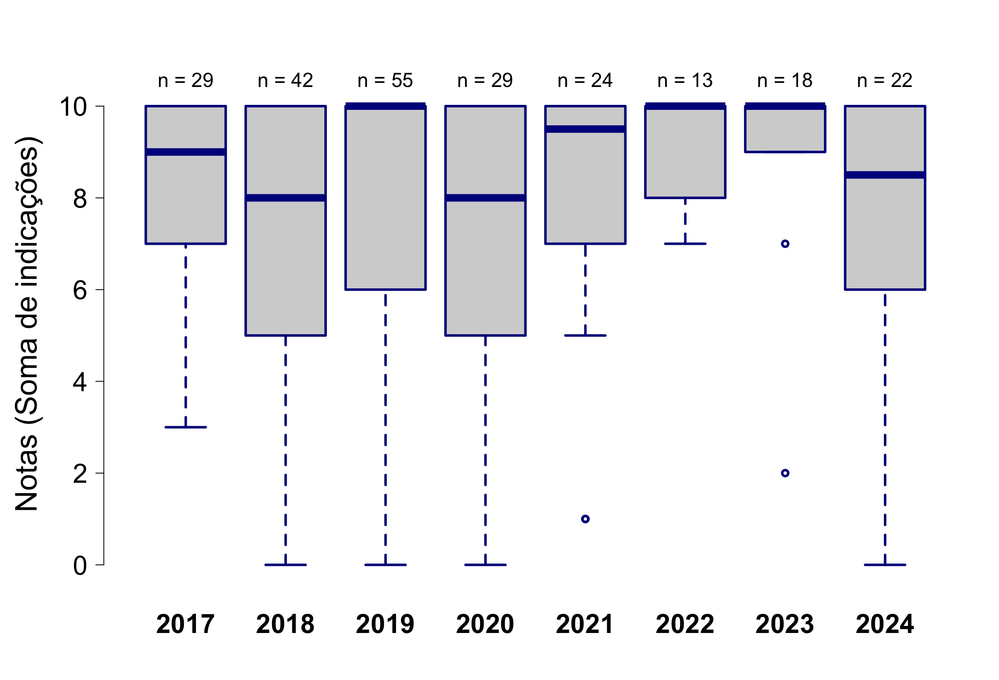

# AVALIAÇÃO DE TESES E DISSERTAÇÕES DO IB-USP 

## ECOLOGIA

## Tamanho da amostra

Foram consideradas apenas as fichas das defesas ocorridas no último quadriênio (defesas entre 2021 e 2024)

**Tabela 1.** Número de trabalhos com ao menos uma ficha preenchida  

|                 | Eco|  IB|
|:----------------|---:|---:|
|Mestrado         |  30| 143|
|Doutorado        |  28| 123|
|Doutorado direto |   0|  10|
|Todos cursos     |  58| 276|

**Tabela 2.** Número de fichas  

|                 | Eco|  IB|
|:----------------|---:|---:|
|Mestrado         |  72| 325|
|Doutorado        |  68| 313|
|Doutorado direto |   0|  22|
|Todos cursos     | 140| 660|
 

## Indicadores

Os avaliadores foram perguntados sobre 10 quesitos e foram orientados a indicar quais dos quesitos o trabalho satisfazia de maneira muito boa ou excelente. Os quesitos estão indicados abaixo, com o número de avaliações que julgaram o trabalho com muito bom ou excelente:  

**Tabela 3.** Quesitos indicados como muito bom ou excelente
   
|criterios                                                                          | frequencia| porcentagem|
|:----------------------------------------------------------------------------------|----------:|-----------:|
|Excelencia na redacao                                                              |        117|       83.57|
|Excelencia na contextualizacao teorica                                             |        101|       72.14|
|Excelencia nos objetivos: bem definidos e condizentes com o titulo pleiteado       |        108|       77.14|
|Excelencia nas hipoteses: perguntas e/ou hipoteses sao claras e explicitas         |         98|       70.00|
|Excelencia na originalidade e na relevancia do trabalho                            |        121|       86.43|
|Excelencia nos metodos: bem descritos e adequados para responder a(s) pergunta(s)  |         91|       65.00|
|Excelencia nas analises: bem descritas e adequadas para responder a(s) pergunta(s) |         89|       63.57|
|Excelencia nos resultados: bem apresentados e respondem a(s) pergunta(s).          |         98|       70.00|
|Excelencia na discussao: solida e fortemente alicercada nos resultados obtidos.    |         83|       59.29|
|Excelencia na literatura usada: adequada e atualizada                              |         93|       66.43|

## Notas
Além da análise individual de cada critério, foi realizada também a soma dos aspectos em que a tese/dissertação foi descrita como excelente ou muito boa. As notas de cada tese são as somas do número de indicações por tese/dissertação. Dentre as fichas avaliadas, a média calculada para o curso de Mestrado foi 6.8. (mediana = 7) Doutorado foi 7,4 (mediana = 9).

  
**Figura 1.** Notas calculadas por indicações de teses/dissertações como excelentes ou muito boas. As curvas são kernels de densidade probabilística, uma alternativa preferível a histogramas para representar distribuições de frequência.

  
**Figura 2.** Evolução das notas calculadas por indicações de teses/dissertações como excelentes ou muito boas nos últimos dois quadriênios (entre 2017 e 2024).

  
**Figura 3.** Notas calculadas por indicações de teses/dissertações como excelentes ou muito boas por programa. As curvas são kernels de densidade probabilística.

## Qualidade relativa

A avaliação anônima feita pelos participantes das bancas de defesa, que indicaram a qualidade do trabalho relativa a todos que já orientou ou avaliou, entre quatro classes:

- Abaixo dos 50% melhores que já avaliou/orientou
- Entre os 50% melhores
- Entre os 25% melhores
- Entre os 10% melhores

**Tabela 4.** Qualidade relativa do trabalho (o quesito foi avaliado em 137 fichas)  

|                        | Mestrado| Doutorado| Total|
|:-----------------------|--------:|---------:|-----:|
|Abaixo dos 50% melhores |        2|         4|     6|
|Entre os 50% melhores   |       24|        10|    34|
|Entre os 25% melhores   |       22|        26|    48|
|Entre os 10% melhores   |       23|        26|    49|

  
**Figura 4.** Qualidade relativa - Mestrado. Também indicado o número esperado em cada categoria se o conjunto avaliado e o já conhecido pela banca forem iguais em qualidade. 

 
**Figura 5.** Qualidade relativa - Doutorado. Também indicado o número esperado em cada categoria se o conjunto avaliado e o já conhecido pela banca forem iguais em qualidade. 

### Evolução da Qualidade relativa - Mestrado

  
**Figura 6.** Evolução da qualidade relativa - Mestrado. Evolução da proporção de teses/dissertações defendidas nos dois últimos quadriênios (entre 2017 e 2024) em cada classe de qualidade. 

### Evolução da Qualidade relativa - Doutorado  

  
**Figura 7.** Evolução da qualidade relativa - Mestrado. Evolução da proporção de teses/dissertações defendidas nos dois últimos quadriênios (entre 2017 e 2024) em cada classe de qualidade. 

## Impacto potencial
 
**Tabela 5.** Impacto potencial do trabalho (o quesito foi avaliado em 134 fichas)  

|           | Mestrado| Doutorado| Sum|
|:----------|--------:|---------:|---:|
|nao public |        2|         2|   4|
|baixo      |       33|        10|  43|
|medio      |       35|        52|  87|
|alto       |        0|         0|   0|
|Sum        |       70|        64| 134|

  
**Figura 8.** Proporção de teses e dissertações defendidas entre 2021 e 2024, por classe de impacto. Os participantes das bancas de defesa indicaram o impacto potencial da melhor publicação resultante da tese/dissertação, entre quatro classes: (i) há baixa chance de publicação; (ii) impacto baixo; (iii) impacto médio; (iv) impacto alto.

  
**Figura 10.** Evolução da proporção de teses defendidas entre 2017 e 2024 em cada classe de impacto. 

  
**Figura 11.** Evolução da proporção de dissertações defendidas entre 2017 e 2024 em cada classe de impacto. 

## Comentários

Por fim, no campo para comentários, 98 fichas contém observações, a maioria delas elogiosas, destacando a qualidade da tese. Todas as observações foram transcritas no seguinte formato: **id aluno**: programa: comentário.

